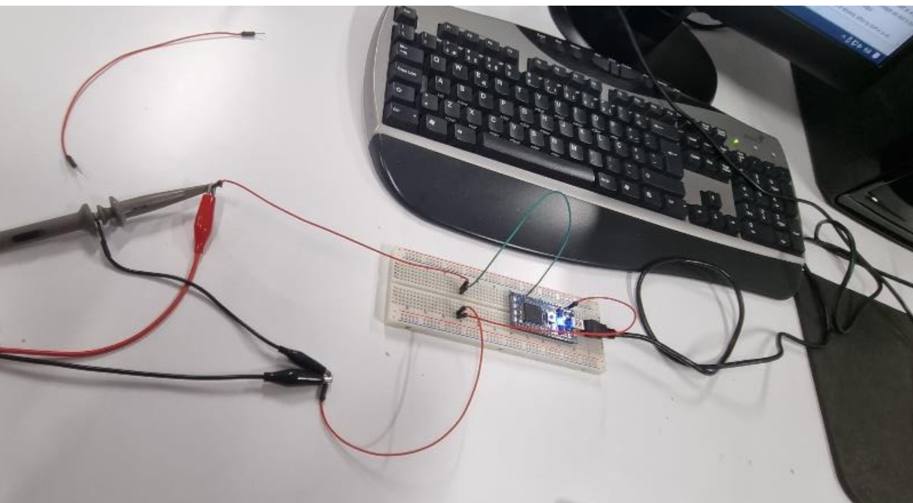
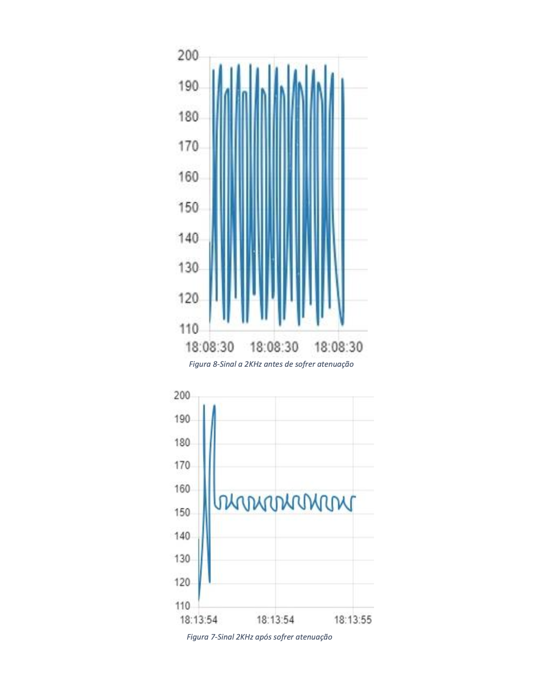

# Digital Low-Pass Filter (Embedded Systems)

## Overview
This project implements a **digital low-pass filter** using an embedded system based on the **ARM Cortex-M3 (mbed LPC1768)**.

The system acquires an analog signal, processes it in real time using a filtering algorithm, and visualizes the results through **Node-RED**.

## Objectives
- Acquire analog signals using ADC  
- Implement a digital low-pass filter  
- Analyze signal behavior before and after filtering  
- Validate theoretical concepts through real-world implementation  

## Technical Concept
A low-pass filter allows **low-frequency signals** to pass while attenuating high-frequency components.

In this project, a **moving average filter** was implemented to simulate the filtering effect.

## System Architecture
- Signal Generator → Input Signal  
- mbed LPC1768 → Signal Processing  
- C/C++ Algorithm → Moving Average Filtering  
- Node-RED → Data Visualization  

## Technologies Used
- C / C++  
- ARM Cortex-M3 (mbed LPC1768)  
- Keil Studio  
- Node-RED  
- Embedded Systems  
- Signal Processing  

## Implementation
The filter was implemented using a **moving average window**:

#define JANELA 10  
#define FREQ_CORTE 1000.0  

The system samples the signal and applies filtering in real time.

## Results

### High Frequency (2 kHz)
- Signal is attenuated  
- Noise is reduced  

### Low Frequency (20 Hz)
- Signal is preserved  
- Minimal distortion observed  

These results confirm correct filter behavior according to theoretical expectations.

## Experimental Setup

## Output Signals
- Original Signal  
- Filtered Signal  

## Full Report
[Download Full Report](Report_Low_FILTER.pdf)

## Key Learnings
- Embedded signal processing  
- Real-time data acquisition  
- Practical implementation of digital filters  
- Integration between hardware and software  

## Author
**Alexandre Saraiva**  
Electrical and Computer Engineering Student

🔗 LinkedIn: https://linkedin.com/in/alexandre-saraiva12  
💻 GitHub: https://github.com/ALEXs-G  

---
