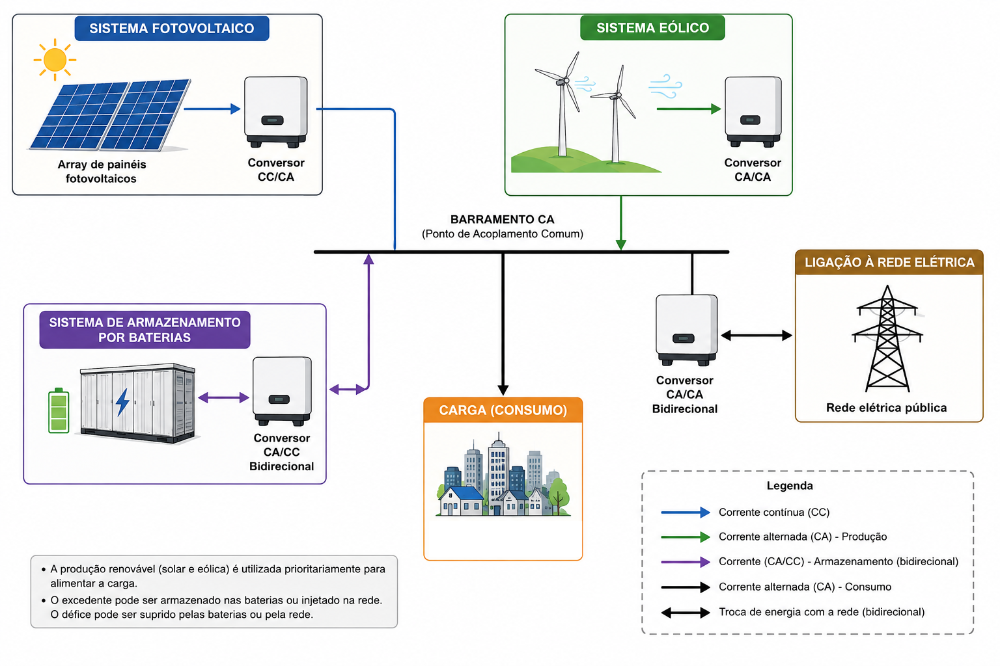
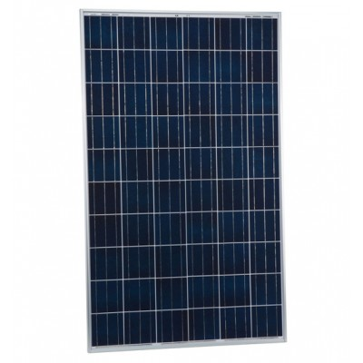
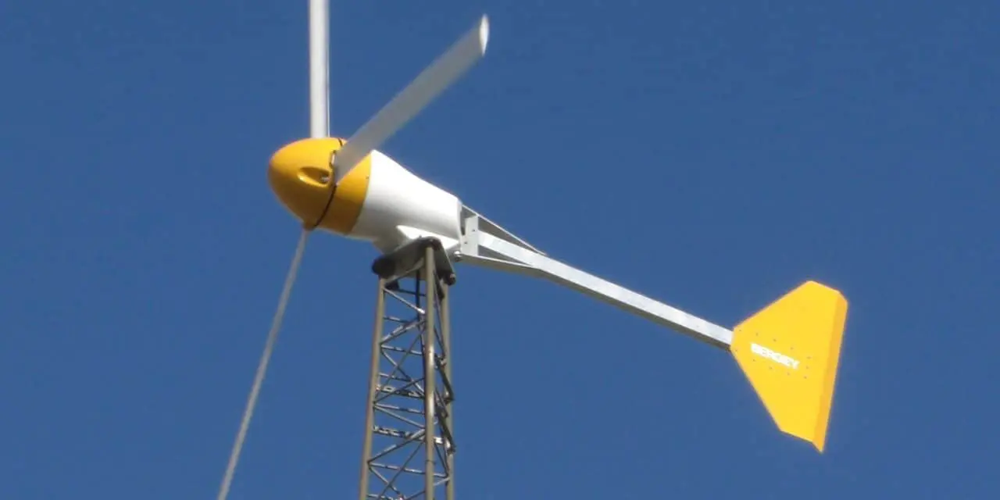
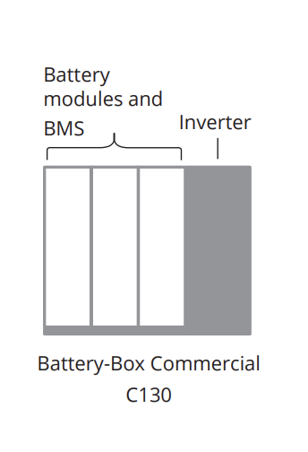
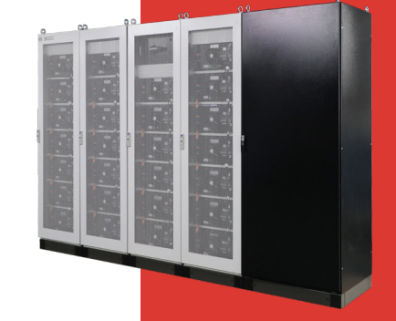

## Hybrid Renewable Energy System for a Small-Scale Grid-Connected Load

This project was developed as part of the **Power Systems** course at the **University of Beira Interior (UBI)**. It focuses on the modeling and simulation of a **grid-connected Hybrid Renewable Energy System (HRES)** designed to supply a **small-scale electrical load with an average demand of 5 kW**. The system integrates photovoltaic generation, wind power, battery energy storage, and the utility grid to maximize renewable energy utilization while ensuring uninterrupted power supply. 

The simulation was fully implemented in **MATLAB**, using hourly meteorological and electrical data, including solar irradiance, wind speed, ambient temperature, electrical demand, and dynamic electricity prices. A rule-based Energy Management System (EMS) was developed to intelligently control energy exchange between renewable sources, battery storage, and the electrical grid. 

## Project Report

[Download Full Report](HRSsimulationREPORT.pdf)

### Project Objectives

- Develop a MATLAB simulation model for a hybrid renewable energy system.
- Model photovoltaic generation based on solar irradiance and temperature.
- Model wind generation using a commercial small-scale wind turbine.
- Integrate a Battery Energy Storage System (BESS).
- Design a rule-based Energy Management Strategy (EMS).
- Simulate energy exchange with the electrical grid.
- Evaluate the technical performance of the hybrid system through weekly and annual simulations. 
  

### System Configuration

- **Photovoltaic System:**
- 31.25 kWp (125 × Sharp ND-R250A5 solar panels)

  

- **Wind System:** 4.8 kW (4 × Bergey BWC XL.1 wind turbines)

  

- **Battery Storage:** BYD Battery-Box Commercial C130
  - 131 kWh nominal capacity
  - 91.7 kWh usable capacity
  - 88 kW maximum charge/discharge power

    

     

- **Average Electrical Load:** 5 kW
 

### Energy Management Strategy

The Energy Management System follows a rule-based control algorithm designed to optimize energy usage and operating costs:

- Renewable generation is always prioritized to supply the electrical load.
- Excess renewable energy is stored in the battery whenever storage capacity is available.
- If the battery is fully charged or electricity prices are high, surplus energy is exported to the electrical grid.
- During energy shortages, the system decides between battery discharge and grid import according to the battery State of Charge (SOC) and the current electricity price.
- The utility grid guarantees continuous power supply whenever renewable generation and battery storage are insufficient. 

### Simulation Results

The developed hybrid energy system achieved the following annual performance:

- **Annual Load Demand:** 46.86 MWh
- **Installed Renewable Capacity:** 36.05 kW
- **Renewable Energy Generated:** 42.19 MWh
- **Grid Energy Imported:** 14.89 MWh
- **Grid Energy Exported:** 9.82 MWh
- **Battery Charging Energy:** 4.57 MWh
- **Battery Discharging Energy:** 4.16 MWh
- **Battery Autonomy:** 18.3 hours

### Technologies Used

- MATLAB
- Renewable Energy Systems
- Photovoltaic Energy Modeling
- Wind Energy Modeling
- Battery Energy Storage Systems (BESS)
- Energy Management Systems (EMS)
- Smart Grid Simulation
- Power System Analysis

This project demonstrates the design and simulation of a small-scale smart hybrid energy system capable of combining renewable energy sources, battery storage, and grid interaction to improve energy efficiency, increase renewable energy utilization, and guarantee reliable power supply for distributed energy applications.
