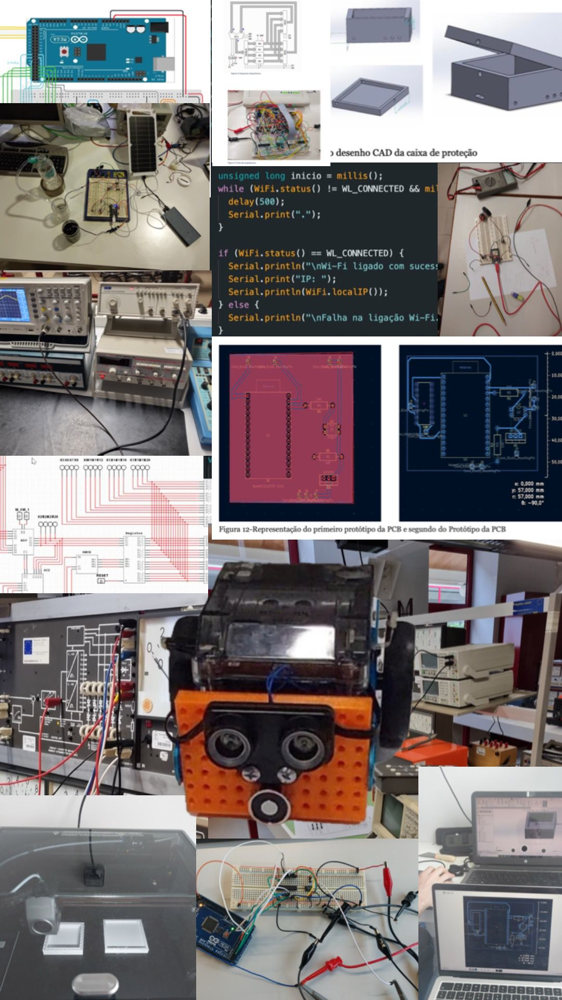

# Engineering Portfolio

Portfolio of engineering projects developed during my Electrical and Computer Engineering degree, covering areas such as embedded systems, IoT, signal processing, computer vision and control systems.

## Overview

This repository gathers practical projects developed throughout my academic journey, with a strong focus on:

- Embedded systems and microcontrollers  
- Signal processing and digital filters  
- Computer vision and AI  
- Automation and control systems  
- Hardware-software integration  

Each project demonstrates hands-on experience in designing, implementing and testing real engineering systems.

---

## Repository Structure

The portfolio is organized into individual projects, each contained in its own folder:

### Signal Processing and Filters
- `band-pass-filter`  
- `digital-low-pass-filter (embedded systems)`  
- `fir-filter-embedded-system`  

Focus: analog and digital filter design, embedded implementation, signal analysis.

---

### Telecommunications
- `cellular-traffic-simulation`  

Focus: Erlang-B modelling, traffic analysis, Python simulation.

---

### Computer Vision and AI
- `fire-detection-ai`  

Focus: image processing, CNN models, classification.

---

### Embedded Systems and IoT
- `smart-irrigation-system`  
- `water-ph-control-system`  
- `thermocouple-temperature-system`  

Focus: sensor integration, real-time systems, automation.

---

### Robotics and Control
- `robotics-factory`  
- `traffic-light-controller`  

Focus: control logic, system coordination, hardware implementation.

---

### Computer Architecture
- `microprocessor-architecture-lab`  

Focus: low-level system design and architecture.

---

## What Each Project Contains

Each project typically includes:

- Source code  
- Technical documentation (README)  
- Images or system diagrams  
- Experimental results or reports  

---

## Skills Demonstrated

- Embedded systems development  
- Electronics and circuit design  
- Python and C/C++ programming  
- Signal processing  
- Computer vision and machine learning  
- System integration and testing  

---

## Academic Context

- Electrical and Computer Engineering  
- University of Beira Interior  

---

## Author

Alexandre Saraiva  

LinkedIn:  
https://linkedin.com/in/alexandre-saraiva12  

GitHub:  
https://github.com/ALEXs-G  
