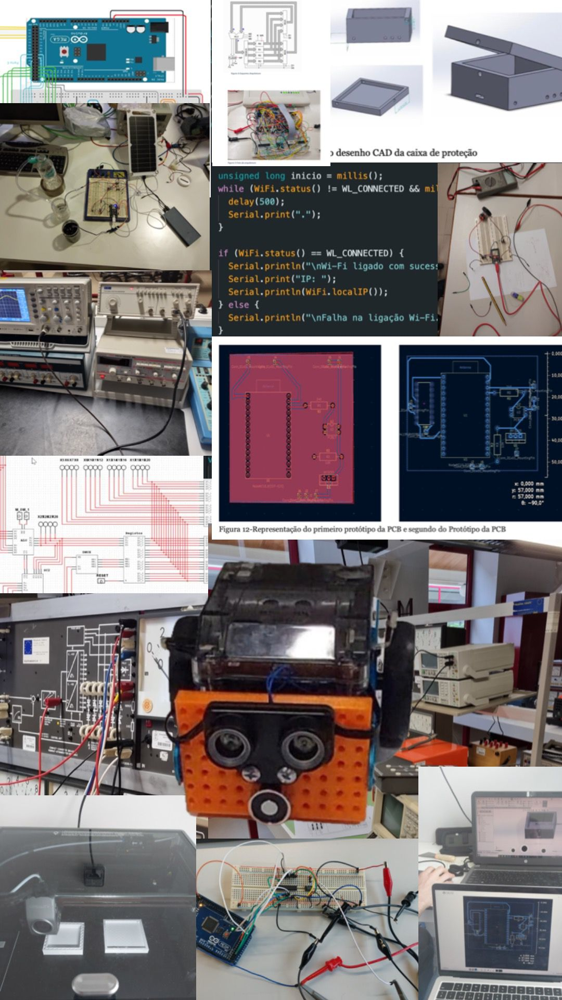

# Alexandre Saraiva — Engineering Portfolio

Electrical and Computer Engineering student (University of Beira Interior, Portugal) focused on **electronics, instrumentation, test & measurement and embedded systems**.

[LinkedIn](https://linkedin.com/in/alexandre-saraiva12) · [GitHub](https://github.com/ALEXs-G)

Each project page states its **status**, **context** (academic or personal), **team** and **my contribution**, and links to the original report.

---

## Featured Projects

| Project | What was done | Status |
|---|---|---|
| [**Type K Thermocouple Measurement System**](thermocouple-temperature-system/) | Signal conditioning with LM335 cold-junction compensation for 0–350 °C → 0–2.5 V; output measured at 8 temperatures (linear response, +0.12 V offset at 0 °C) | Complete |
| [**Smart Self-Sustainable Irrigation System**](smart-irrigation-system/) | ESP8266 node with soil-moisture and water-level sensors, pump control, solar supply, ThingSpeak monitoring and deep sleep; prototype demonstrated (team of 3) | Partial |
| [**Analog Band-Pass Filter**](band-pass-filter/) | 2nd-order Chebyshev high-pass + low-pass stages (1.5–10 kHz) with TL081 op-amps; frequency and square-wave response measured with PicoScope 7 and compared to MATLAB | Complete |

---

## All Projects

### Instrumentation and Analog Electronics
- [Type K Thermocouple Measurement System](thermocouple-temperature-system/) — Complete
- [Analog Band-Pass Filter](band-pass-filter/) — Complete

### Embedded Systems and IoT
- [Smart Self-Sustainable Irrigation System](smart-irrigation-system/) — ESP8266, C/C++ — Partial
- [FIR Filter on ATmega2560](fir-filter-embedded-system/) — AVR Assembly, DAC0832 — Complete
- [Digital Low-Pass Filter](digital-low-pass-filter/) — mbed LPC1768, C — Complete (lab exercise)
- [Traffic Light Controller](traffic-light-controller/) — AVR Assembly, GAL22V10 — Partial
- [Water Filtration & pH Control](water-ph-control-system/) — AVR Assembly — Historical exercise

### Digital Systems
- [Microprocessor Architecture and Controller](microprocessor-architecture-lab/) — 74LS TTL, GAL22V10, WinCUPL — Partial

### Energy Systems
- [Grid-Tied Hybrid Renewable Energy System](grid-tied-hybrid-energy-system/) — MATLAB simulation — Complete

### Robotics
- [mBot2 Robot@Factory Lite](robotics-factory/) — team project, electromagnet actuator and CAD mount — Partial

### Telecommunications
- [Cellular Traffic Simulation (Erlang-B)](cellular-traffic-simulation/) — Python — Complete

---

## Technical Skills

- **Electronics:** analog signal conditioning, op-amp filters, sensor interfacing, optocoupled actuator driver
- **Measurement:** digital multimeter, oscilloscope (PicoScope 7), signal generator
- **Embedded:** ESP8266 (C/C++), ATmega2560 (AVR Assembly: ADC, interrupts, sleep modes), mbed LPC1768 (C)
- **Digital logic:** 74LS TTL, GAL22V10 (WinCUPL)
- **Software:** MATLAB, Python, C/C++, Assembly
- **Design tools:** KiCad (PCB layout), SolidWorks (enclosures and mounts)
- **IoT:** Wi-Fi, ThingSpeak, Node-RED

---

## Academic Context

BSc Electrical and Computer Engineering — University of Beira Interior, Covilhã, Portugal.
Most original reports are written in Portuguese; project pages are in English.

---

## Project Gallery

