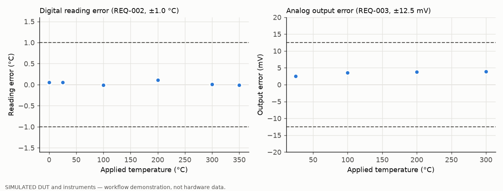

# Automated Test & Measurement Bench (Simulation Baseline)

| | |
|---|---|
| **Status** | Experimental, in development. Simulation mode is implemented and tested; hardware mode is an unvalidated template. |
| **Context** | Personal project (2026) |
| **My contribution** | Sole author |
| **Evidence** | [requirements](requirements.md) · [test plan](test-plan.md) · [architecture](docs/architecture.md) · [example report](results/example/report.md) · [tests](tests/) · CI workflow `.github/workflows/test-bench.yml` |

> The current baseline implementation includes a simulated DUT so that the automated validation
> workflow can be reproduced without laboratory equipment. Hardware interfaces can later be added
> using PySerial/PyVISA.
>
> **No physical instrument or device has been tested with this code.** All results in this folder
> come from software models.

---

## Purpose

This project shows a requirement-driven test workflow:

```
Requirement → Test case → Stimulus → Measurement → Pass/Fail → Log → Result → Report
```

The DUT is a temperature transmitter (0–350 °C, 0–2.5 V analog output plus a text query
interface). It reuses the design targets of the [thermocouple measurement project](../thermocouple-temperature-system/),
so the next step is to point the same tests at that circuit with a real DMM and calibrator.

## What is implemented

| Capability | Where |
|---|---|
| 9 requirements, 10 test cases, requirement → test → verdict traceability | `src/validation.py`, [requirements.md](requirements.md), [test-plan.md](test-plan.md) |
| Simulated DUT: analog + digital interface, noise, saturation, burnout, seeded | `src/dut.py` |
| Deterministic fault injection: out-of-range sensor, open sensor, excessive noise, timeout, communication loss | `src/dut.py` (`Fault`), `fault_after` |
| Instrument abstraction (source, voltmeter, DUT link) with simulated implementations | `src/instruments.py` |
| Hardware templates: SCPI DMM (PyVISA), serial DUT link (pyserial), operator-set calibrator. **Not validated.** | `src/instruments.py` |
| Verdicts PASS / FAIL / ERROR / NOT_RUN. A link failure is ERROR, not FAIL. | `src/validation.py` |
| Bench self-check: nominal tests on faulty DUTs must not pass | `SELF_CHECKS` |
| Outputs: CSV (every reading), JSON, Markdown report, PNG | `src/report.py` |
| 43 pytest tests; ruff lint; GitHub Actions CI | `tests/`, `.github/workflows/test-bench.yml` |

## Example output (simulation)

From [`results/example/report.md`](results/example/report.md): 10/10 test cases PASS on the
healthy simulated DUT, and 6/6 injected faults were detected by the self-check.



## Run

```bash
cd automated-test-measurement-bench
python -m venv .venv && source .venv/bin/activate
pip install -r requirements.txt

pytest                                  # 43 tests, < 1 s
python examples/run_campaign.py         # writes results/simulation_<timestamp>/
```

`run_campaign.py` exits with status 1 if any test fails or errors, or if a self-check does not
detect its fault. That makes it usable as a CI gate.

### Hardware mode (not validated)

```bash
pip install -r requirements-hw.txt
cp configs/hardware.example.json configs/hardware.json   # set VISA resource and serial port
python examples/run_campaign.py --config configs/hardware.json
```

In hardware mode the operator sets the temperature source when prompted. Tests that need
software fault injection are reported as `NOT_RUN`.

## Layout

```
automated-test-measurement-bench/
├── README.md  requirements.md  test-plan.md
├── requirements.txt  requirements-hw.txt  pyproject.toml
├── src/        dut.py  instruments.py  acquisition.py  validation.py  report.py
├── tests/      test_nominal.py  test_boundaries.py  test_faults.py  test_communications.py  test_report.py
├── configs/    simulation.json  hardware.example.json
├── examples/   run_campaign.py
├── results/    example/ (committed reference run); other runs are git-ignored
└── docs/       architecture.md
```

## Design decisions

- **Standard library at runtime.** `random`, `statistics`, `csv` and `json` cover the needs.
  matplotlib is optional (plots are skipped without it). pandas and numpy are not needed at this scale.
- **Simulated clock.** Timeouts and latencies are exact and tests take no wall-clock time.
  Hardware mode uses a monotonic wall clock.
- **Fresh DUT per test.** Results do not depend on test order, and every run with the same seed is identical.
- **Late replies are not reused.** The serial template flushes the input buffer before each query, so a late answer cannot be read as the next reply.

## Limitations

- Requirement tolerances were chosen for the baseline; they are not product specifications.
- No uncertainty model for the bench's own instruments.
- Hardware classes have not been run against real instruments.

## Next steps

1. Run TEST-002 against the real [thermocouple circuit](../thermocouple-temperature-system/) with a SCPI DMM and a thermocouple calibrator.
2. Add an uncertainty budget per measurement point and report results as value ± U (k = 2).
3. Add a step-response / settling-time test.
