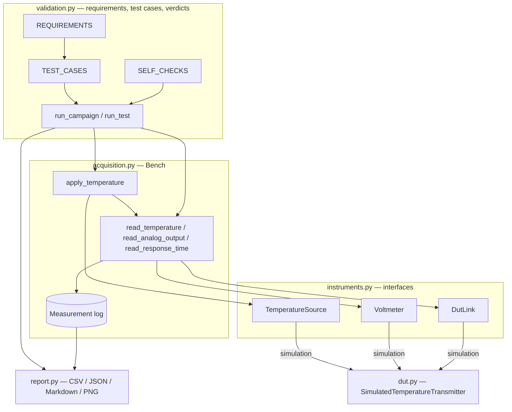
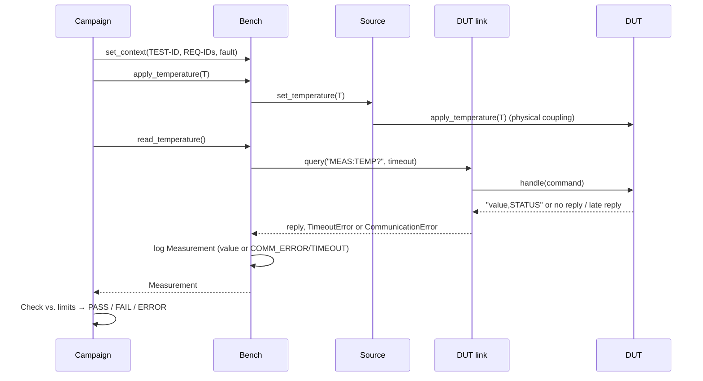

# Architecture

## Layers

The test cases call only `Bench` methods, and `Bench` calls only the instrument interfaces.
Switching from simulation to hardware therefore means building the `Bench` from different
instrument classes (`build_hardware_bench`). The test cases do not change.

## Test workflow

## DUT text protocol

| Command | Reply | Notes |
|---|---|---|
| `*IDN?` | `SIMULATED,TEMP-TX,SN0001,1.0` | |
| `MEAS:TEMP?` | `<value>,<STATUS>` | STATUS ∈ {OK, OUT_OF_RANGE, SENSOR_OPEN}; value `NAN` when the sensor is open |
| anything else | `ERR,UNKNOWN_COMMAND` | |

## Determinism

- All DUT randomness comes from `random.Random(seed)`. The seed is in the config.
- Time is a `SimClock` that advances only when an instrument spends time (settling, reading,
  reply latency, timeout). Timeout tests are therefore exact and take no wall-clock time.
- A fresh DUT and bench are built for every test case, so results do not depend on test order.

## Fault model

| Fault | Effect in the model |
|---|---|
| `sensor_out_of_range` | The sensor value becomes 500 °C |
| `sensor_disconnected` | No sensor value; status SENSOR_OPEN; analog output at burnout (2.6 V) |
| `excessive_noise` | Noise on both channels multiplied by 50 |
| `timeout` | Reply latency 500 ms (> 200 ms timeout) |
| `communication_loss` | No reply at all |

`fault_after = N` activates a fault after N measurement queries. This models a link lost in the middle of a test.
