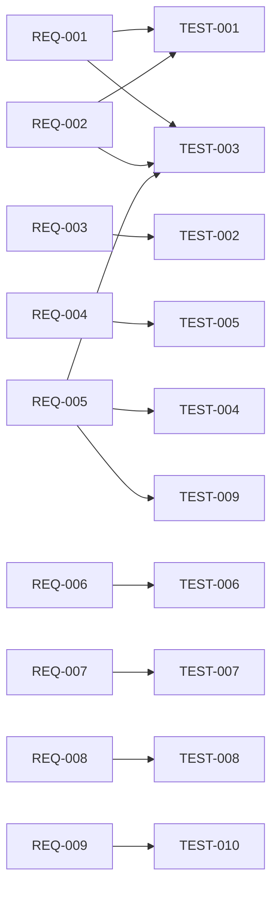

# Test Plan — Temperature Transmitter (simulation baseline)

## 1. Scope and approach

Verify the requirements in [requirements.md](requirements.md) with automated, repeatable
tests. Each test case defines a stimulus, the measurements to take, pass/fail limits and the
requirements it covers. A campaign runs all test cases on a fresh DUT instance, then runs a
**bench self-check**: nominal tests are repeated against deliberately faulty DUTs to show that
each test can detect the defect it targets.

## 2. Test environment

| Item | Simulation mode (implemented) | Hardware mode (template, not validated) |
|---|---|---|
| DUT | `SimulatedTemperatureTransmitter`, seeded | Real transmitter with the same text protocol over serial |
| Stimulus | `SimulatedTemperatureSource` (ideal) | Thermocouple calibrator set by the operator (`ManualTemperatureSource`) |
| Voltmeter | `SimulatedVoltmeter`, 0.1 mV resolution | SCPI DMM over PyVISA (`ScpiVoltmeter`) |
| Link | `SimulatedDutLink`, simulated clock | `SerialDutLink` (pyserial) |
| Fault injection | Software (`Fault` enum) | Not available; fault tests reported as `NOT_RUN` |
| Configuration | [`configs/simulation.json`](configs/simulation.json) | [`configs/hardware.example.json`](configs/hardware.example.json) |

## 3. Verdict rules

| Verdict | Meaning |
|---|---|
| PASS | All checks of the test met their limits |
| FAIL | At least one check outside its limit: the DUT does not meet the requirement |
| ERROR | The test could not be completed (link failure, protocol error). This says nothing about DUT performance. |
| NOT_RUN | Not executable in the current mode |

A requirement is **VERIFIED** only if every test linked to it passes.

## 4. Test cases

| Test ID | Title | Requirements | Stimulus / condition | Measurements | Pass criteria |
|---|---|---|---|---|---|
| TEST-001 | Nominal temperature acquisition | REQ-001, REQ-002 | 25, 100, 200, 300 °C | Digital reading + status | status OK, \|error\| ≤ 1.0 °C |
| TEST-002 | Analog output transfer function | REQ-003 | 25, 100, 200, 300 °C | Analog output voltage | \|Vo − 2.5/350·T\| ≤ 12.5 mV |
| TEST-003 | Range boundaries | REQ-001, REQ-002, REQ-005 | 0 and 350 °C (inside); −1 and 351 °C (outside) | Reading + status | Inside: OK and ≤ 1.0 °C; outside: OUT_OF_RANGE |
| TEST-004 | Out-of-range stimulus | REQ-005 | −10, 360, 500 °C | Status | OUT_OF_RANGE |
| TEST-005 | Noise / repeatability | REQ-004 | 150 °C, 20 readings | Standard deviation | ≤ 0.2 °C |
| TEST-006 | Open sensor detection | REQ-006 | 100 °C, **fault: sensor disconnected** | Status, value, analog output | SENSOR_OPEN, no value, Vo ≥ 2.55 V |
| TEST-007 | Query response time | REQ-007 | 25 °C, 10 queries | Reply latency | max ≤ 200 ms |
| TEST-008 | Communication loss handling | REQ-008 | 100 °C, **fault: link lost after the 1st query** | Status and value of the 2nd reading | COMM_ERROR, no value |
| TEST-009 | Sensor value out of range | REQ-005 | 100 °C applied, **fault: sensor reports 500 °C** | Status | OUT_OF_RANGE |
| TEST-010 | Measurement log completeness | REQ-009 | 50 °C, 3 measurement types | Log records | All mandatory fields present |

## 5. Bench self-check (fault injection)

| Test | Injected fault | Expected verdict | Purpose |
|---|---|---|---|
| TEST-001 | sensor_out_of_range | FAIL | Accuracy/status check detects a corrupted sensor |
| TEST-001 | sensor_disconnected | FAIL | Nominal test detects an open sensor |
| TEST-002 | sensor_disconnected | FAIL | Transfer check detects the burnout voltage |
| TEST-005 | excessive_noise | FAIL | Repeatability limit detects noise ×50 |
| TEST-007 | timeout | FAIL | Latency check detects a 500 ms reply |
| TEST-001 | communication_loss | ERROR | A link failure aborts the test instead of producing PASS/FAIL |

## 6. Traceability

Requirement → test → result is generated for every campaign, in the `report.md` and
`results.json` traceability section. A static view:

## 7. Outputs

`measurements.csv` (one row per reading, including the `injected_fault` column), `results.json`,
`report.md` and `nominal_errors.png`. A reference run is committed in
[`results/example/`](results/example/).

## 8. Not covered (future work)

- Measurement uncertainty of the bench itself (reference source, DMM). In simulation, no uncertainty is claimed.
- Temperature-step response and settling time.
- Long-duration stability and drift.
- Hardware-mode validation with real instruments.
