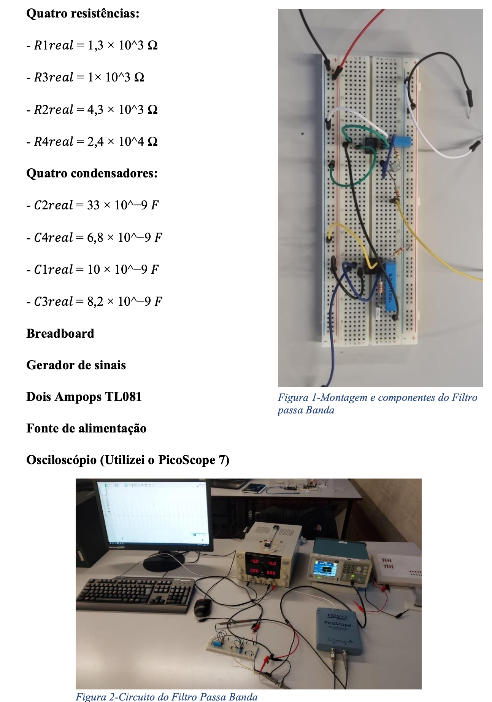

# Analog Band-Pass Filter Design and Implementation

Design, implementation, and experimental validation of a **2nd-order analog band-pass filter** built by cascading a **Chebyshev high-pass filter** and a **Chebyshev low-pass filter**.

---

## Hardware Setup

---

## Project Report

[Download Full Report](Report_Alexandre_TLB1_PSI.pdf)

---

## Overview

This project focused on the development of an **analog band-pass filter** capable of selecting a specific frequency range while attenuating signals outside that band.

The filter was built by combining:

- A **2nd-order high-pass filter**
- A **2nd-order low-pass filter**

Both stages were designed with **Chebyshev characteristics** and then connected in series to obtain the final band-pass response.

---

## Design Specifications

- **Lower cutoff frequency:** 1500 Hz
- **Upper cutoff frequency:** 10 kHz
- **Ripple:** 2.2 dB
- **Filter type:** Analog Chebyshev band-pass

---

## Hardware Components

- Breadboard
- Signal generator
- PicoScope 7
- Power supply
- 2 × TL081 operational amplifiers
- 4 × resistors
- 4 × capacitors

### Real component values used

- **R1 =** 1.3 kΩ
- **R2 =** 4.3 kΩ
- **R3 =** 1.0 kΩ
- **R4 =** 24 kΩ

- **C1 =** 10 nF
- **C2 =** 33 nF
- **C3 =** 8.2 nF
- **C4 =** 6.8 nF

---

## Architecture

The band-pass filter was obtained by cascading:

Input → High-Pass Stage → Low-Pass Stage → Output

This allows frequencies between **1500 Hz and 10 kHz** to pass, while attenuating lower and higher frequency components.

---

## MATLAB Design

MATLAB was used to:

- Design the Chebyshev filter stages
- Compute ideal component values
- Generate Bode plots
- Compare theoretical and experimental responses
- Simulate square-wave filtering

---

## Experimental Results

The experimental response was measured using **PicoScope 7** for frequencies between **1000 Hz and 12000 Hz**.

### Key observations

- The magnitude response showed **reasonable agreement** with the theoretical model
- The phase response contained measurement errors due to incorrect delay extraction
- The filter successfully behaved as a **band-pass filter** in practical tests

---

## Square Wave Validation

The filter was also tested using square waves at:

- **450 Hz**
- **5750 Hz**
- **10 kHz**
- **30 kHz**

The comparison between MATLAB simulations and PicoScope measurements showed that the filter behaved as expected, especially in the pass-band region.

---

## Skills Demonstrated

- Analog signal processing
- Filter design
- Chebyshev approximation
- MATLAB modelling and validation
- Experimental measurement with oscilloscope
- Circuit implementation with operational amplifiers

---

## Tools Used

- MATLAB
- PicoScope 7
- Analog electronics lab equipment
- Breadboard prototyping

---

## Academic Context

- Electrical and Computer Engineering
- University of Beira Interior
- Course: Signal and Image Processing

---

## Author

**Alexandre Saraiva**

LinkedIn  
https://linkedin.com/in/alexandre-saraiva12

GitHub  
https://github.com/ALEXs-G

---

## Why This Project Matters

This project demonstrates:

- Analog electronics design  
- Frequency-domain analysis  
- Practical validation of theoretical models  
- Engineering workflow from design to implementation and testing  
