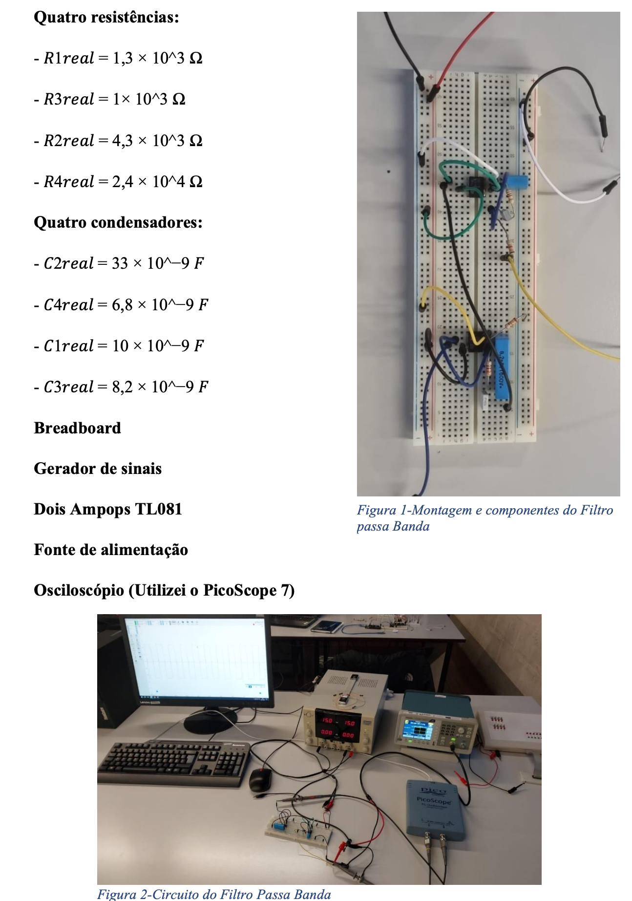

# Analog Band-Pass Filter (Cascaded 2nd-Order Chebyshev HP + LP)

| | |
|---|---|
| **Status** | Complete (historical academic lab, January 2025) |
| **Context** | Academic — *Processamento de Sinal e Imagem* (Signal and Image Processing), University of Beira Interior |
| **My contribution** | Individual lab work: MATLAB design, breadboard build, PicoScope measurements, report |
| **Evidence** | [Report (PT, PDF)](Report_Alexandre_TLB1_PSI.pdf) · [setup photo](Bpass.png) |
| **Source code** | Not included in the repository. The MATLAB design code is listed in the report only. |

---

## Specification

| Parameter | Value |
|---|---|
| Lower cut-off (high-pass stage) | 1500 Hz |
| Upper cut-off (low-pass stage) | 10 kHz |
| Pass-band ripple | 2.2 dB |
| Approximation / order | Chebyshev, 2nd order per stage |

## Implementation

`Input → 2nd-order high-pass → 2nd-order low-pass → Output`, using 2 × TL081 op-amps.

| Component | Value used |
|---|---|
| R1, R2, R3, R4 | 1.3 kΩ, 4.3 kΩ, 1.0 kΩ, 24 kΩ |
| C1, C2, C3, C4 | 10 nF, 33 nF, 8.2 nF, 6.8 nF |

MATLAB was used to design the stages, compute ideal component values, generate Bode plots and
simulate square-wave filtering for comparison with the measurements.

## Test & measurement

| Test | Equipment | Result (from report) |
|---|---|---|
| Frequency response, 1–12 kHz | Signal generator, PicoScope 7 | Magnitude agreed reasonably with the model |
| Phase response | PicoScope 7 | **Invalid:** the report flags the phase values as erroneous ("FALHA nos valores") because the time delay was extracted incorrectly |
| Square-wave response at 450 Hz, 5750 Hz, 10 kHz and 30 kHz | Signal generator, PicoScope 7 | Waveforms consistent with the MATLAB simulation, especially in the pass band |

Measurement uncertainty and the agreement between the two curves were not quantified (no error table or tolerance).
A tabulated set of PicoScope readings is included in the report.

## Limitations and lessons

- The phase measurement method was wrong. Phase should be measured from the time delay between
  zero crossings at a known frequency, or with a gain-phase analyser or the scope's FRA mode,
  and checked at one known point before a sweep.
- No uncertainty analysis. Component tolerances (E-series values against ideal values) were not propagated to the cut-off frequencies.
