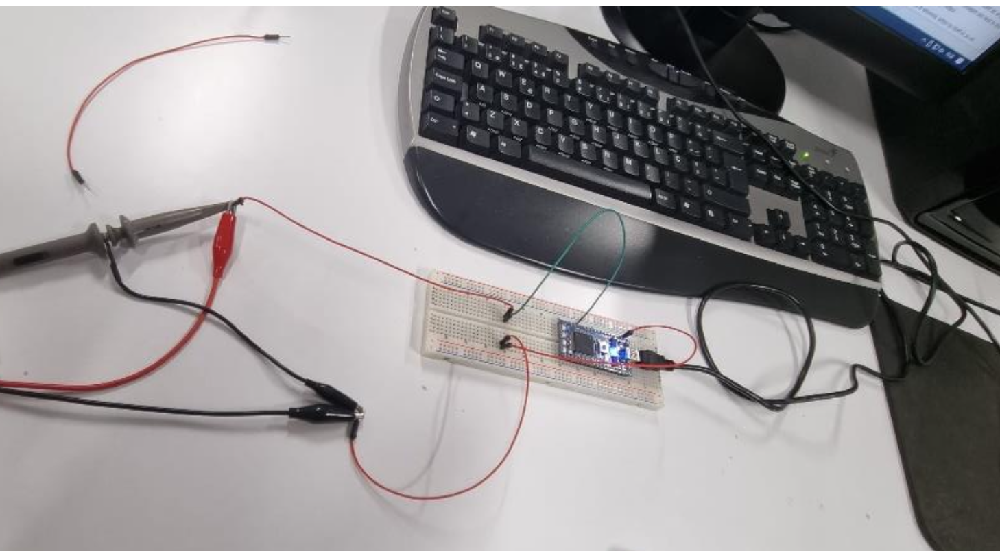
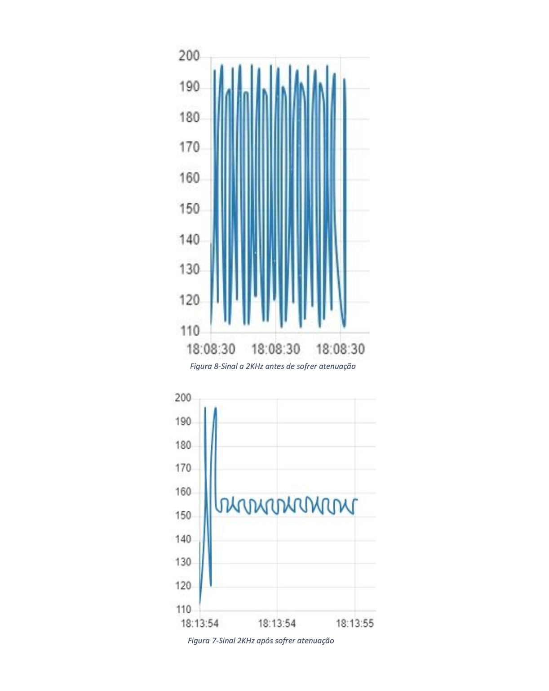

# Digital Low-Pass (Moving-Average) Filter on mbed LPC1768

| | |
|---|---|
| **Status** | Complete as a lab exercise (January 2024). The 2026 review found a sampling-rate issue that invalidates the 2 kHz result; see the review note below. |
| **Context** | Academic — *Análise de Sinais* (Signal Analysis), University of Beira Interior |
| **Team** | Alexandre Saraiva, Furkan Ocak, Gelson José |
| **My contribution** | Three-person lab. The team modified acquisition code provided by the professor to add the filter (report). The report does not attribute tasks. TODO (owner): state individual role. |
| **Evidence** | [Report (PT, PDF)](Report_Low_FILTER.pdf) · [setup photo](setup_sig.png) · [signals](SIgnal.png) |
| **Source code** | Not included in the repository. The C listing is in the report only. |

---

## System

```
Signal generator → mbed LPC1768 ADC (ARM Cortex-M3, C / Keil Studio)
                 → 10-sample moving average in a Ticker ISR → USB serial → Node-RED plot
```

From the report's code: `#define JANELA 10` (window), `#define FREQ_CORTE 1000.0`, and
`tic.attach(&flip, 1.0 / FREQ_CORTE)`. The program acquires 100 samples, prints the raw samples,
waits 3 s, then prints the filtered samples.



## Results (from report)

| Input | Reported observation |
|---|---|
| 20 Hz | Signal preserved |
| 2 kHz | Signal strongly attenuated |



## Review note (2026)

`FREQ_CORTE` is used as the **sampling interval** (1 ms), not as a filter cut-off. So:

- **fs = 1 kHz**, Nyquist = 500 Hz. There is no anti-aliasing filter.
- A **2 kHz input is above Nyquist and aliases**. At exactly 2 kHz every sample falls on the same
  phase, so the sampled signal is nearly constant before any filtering. The reported
  "attenuation at 2 kHz" therefore does not demonstrate low-pass filtering.
- The filter is a 10-sample moving average at fs = 1 kHz: first null at 100 Hz, −3 dB at ≈ 44 Hz.
  The 20 Hz result is consistent with this.

A valid test would keep inputs below 500 Hz (e.g. 20, 44, 100, 200, 400 Hz), measure input and
output amplitude at each, and compare with the moving-average response |sin(πfN/fs) / (N·sin(πf/fs))|.
