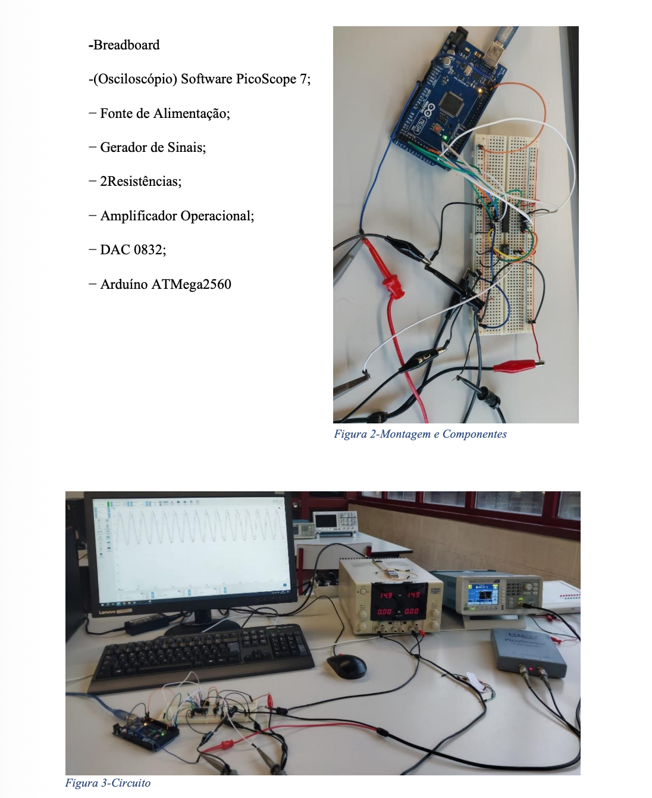

# FIR Filter Implementation on ATmega2560

Implementation of a **Finite Impulse Response (FIR) digital filter** on an **ATmega2560 microcontroller**, integrated with **ADC, DAC and analog output stage**.

| | |
|---|---|
| **Status** | Complete — measured response differs from the theoretical one (see [Results](#results)) |
| **Context** | Academic — Signal and Image Processing, University of Beira Interior, January 2025 |
| **Team** | Individual |
| **My contribution** | Assembly implementation, circuit, measurements and report |
| **Evidence** | [Report (PT, PDF)](report.pdf) (includes the Assembly and MATLAB code) · circuit photo below |

---

## System Setup



---

## Overview

This project covers the **design, implementation and validation of a FIR digital filter**.

The system combines:

- Embedded programming (Assembly)
- Analog signal processing
- Digital-to-Analog conversion (DAC)
- MATLAB-based filter design

---

## System Architecture

### Hardware Components

- ATmega2560 (Arduino)
- DAC0832 (Digital-to-Analog Converter)
- LF356 Operational Amplifier
- Breadboard + Signal Generator
- PicoScope (signal analysis)

The system converts digital signals into analog output using DAC and op-amp stages.

---

## Signal Flow

```
Analog Input → ADC → FIR Filter (Assembly) → DAC → Op-Amp → Output Signal
```

---

## FIR Filter Design

- Order: **N = 25**
- Cutoff frequency: **wc = 0.002** (normalized)
- Designed using MATLAB (`fir1`)

```matlab
N = 25;
wc = 0.002;
b = fir1(N, wc);
```

---

## Embedded Implementation

- Assembly programming (AVR)
- Interrupt-driven ADC reading
- Real-time signal processing
- Memory-based delay line (X[n-k])
- Coefficients scaled by 256 for 8-bit multiplication

### Filter Equation

```
y[n] = Σ b[k] * x[n-k]
```

---

## Results

- Sampling frequency: **8362 Hz**
- Tested across frequencies: **10 Hz → 1000 Hz**

Observations:
- Stable response at low frequencies
- Attenuation at higher frequencies
- Measured attenuation larger than predicted at higher frequencies, and unexpected phase variations

---

## Analysis

Comparison between:

- MATLAB simulation
- Real hardware measurements

Includes gain (dB) and phase response.

---

## Challenges

- Hardware fault: the ADC0 input on the board did not work; ADC1 was used instead
- Noise and signal distortion
- Gap between theoretical and real-world implementation

---

## Technologies Used

- Assembly (AVR)
- MATLAB
- ADC/DAC integration
