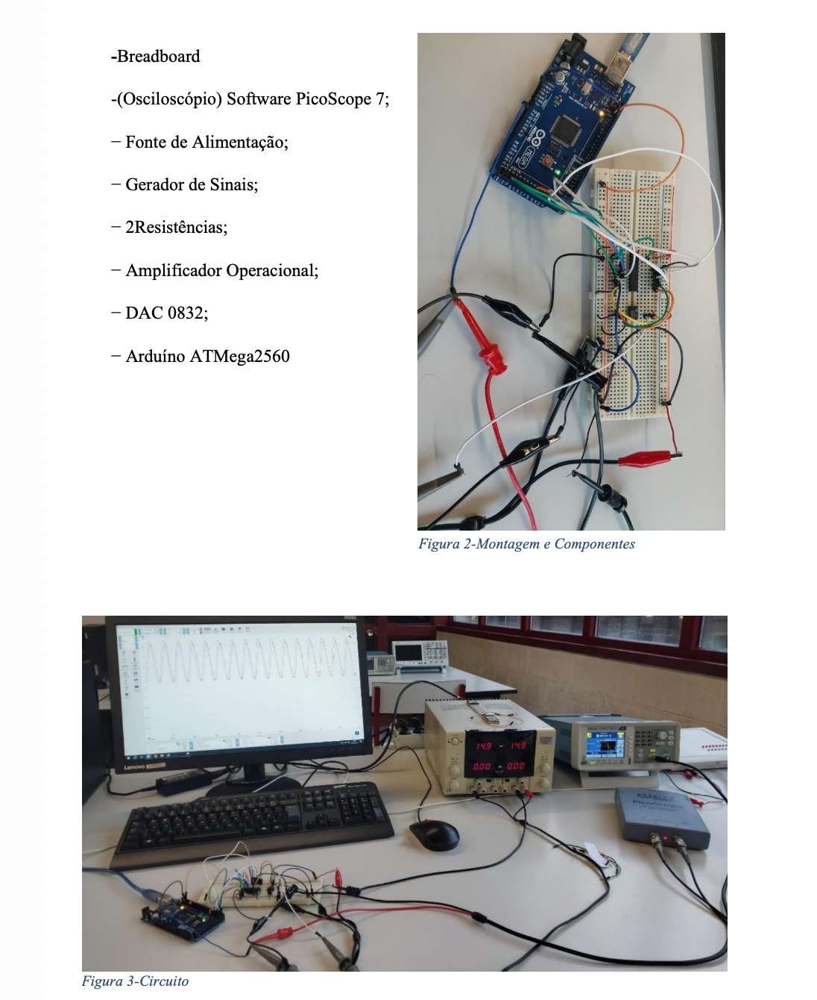

# 📡 FIR Filter Implementation on ATmega2560

Implementation of a **Finite Impulse Response (FIR) digital filter** using an **ATmega2560 microcontroller**, integrated with **DAC, ADC, and analog signal processing components**.

---

## 📸 System Setup



---

## 📄 Project Report

📥 [Download Full Report](Alexandre_TLB2_PSI.pdf)

---

## 🧠 Overview

This project focuses on the **design, implementation, and validation of a FIR digital filter**.

The system combines:

- Embedded programming (Assembly)
- Analog signal processing
- Digital-to-Analog conversion (DAC)
- MATLAB-based filter design

---

## ⚙️ System Architecture

### 🔌 Hardware Components

- ATmega2560 (Arduino)
- DAC0832 (Digital-to-Analog Converter)
- LF356 Operational Amplifier
- Breadboard + Signal Generator
- PicoScope (signal analysis)

📌 The system converts digital signals into analog output using DAC and op-amp stages.

---

## 🔄 Signal Flow

```
Analog Input → ADC → FIR Filter (Assembly) → DAC → Op-Amp → Output Signal
```

---

## 🧪 FIR Filter Design

- Order: **N = 25**
- Cutoff frequency: **wc = 0.002**
- Designed using MATLAB (`fir1`)

### MATLAB Example:

```matlab
N = 25;
wc = 0.002;
b = fir1(N, wc);
```

---

## 💻 Embedded Implementation

- Assembly programming (AVR)
- Interrupt-driven ADC reading
- Real-time signal processing
- Memory-based delay line (X[n-k])

### Filter Equation:

```
y[n] = Σ b[k] * x[n-k]
```

---

## 📊 Results

- Sampling frequency: **8362 Hz**
- Tested across frequencies: **10 Hz → 1000 Hz**

📉 Observations:
- Stable response at low frequencies
- Attenuation at higher frequencies
- Differences between theoretical and experimental results

---

## 📈 Analysis

Comparison between:

- MATLAB simulation
- Real hardware measurements

Includes:
- Gain (dB)
- Phase response

---

## 💻 Technologies Used

- Assembly (AVR)
- MATLAB
- Embedded Systems
- Signal Processing
- ADC/DAC integration

---

## 📚 Academic Context

- 🎓 Electrical and Computer Engineering  
- 🏫 University of Beira Interior  
- 📘 Course: Signal and Image Processing  

---

## 👨‍💻 Author

**Alexandre Saraiva**

🔗 LinkedIn  
https://linkedin.com/in/alexandre-saraiva12  

💻 GitHub  
https://github.com/ALEXs-G  

---

## 🚀 Key Skills Demonstrated

✔ Digital Signal Processing (DSP)  
✔ Embedded systems programming  
✔ MATLAB + hardware integration  
✔ ADC/DAC communication  
✔ Real-time filtering  

---

## ⚠️ Challenges

- Hardware limitations (ADC issues)
- Noise and signal distortion
- Precision vs real-world implementation gap

---

## 🔥 Why This Project Matters

This project shows:

✔ Strong understanding of DSP  
✔ Ability to implement theory in real hardware  
✔ Low-level programming skills  
✔ Engineering problem-solving  

---
