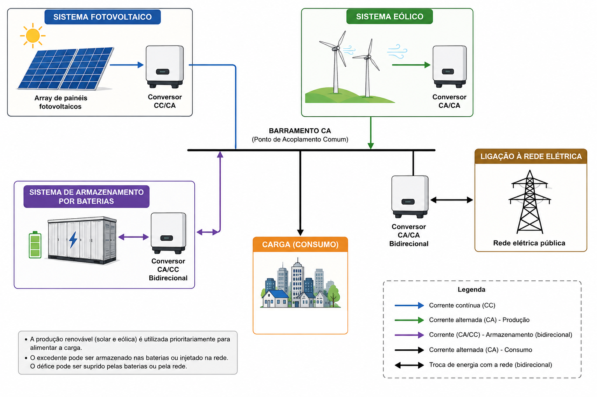
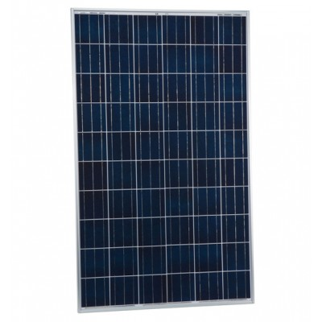
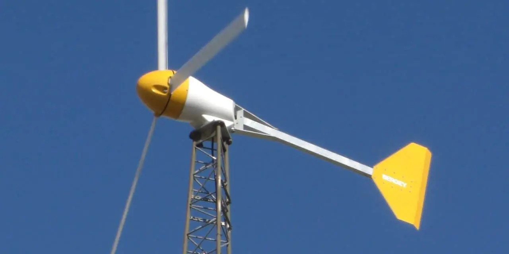
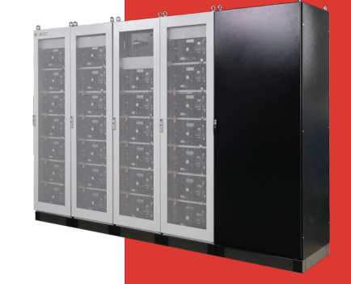

# Hybrid Renewable Energy System for a Small-Scale Grid-Connected Load

Modelling and simulation of a **grid-connected Hybrid Renewable Energy System (HRES)** supplying a **small-scale electrical load with an average demand of about 5 kW**. The system integrates photovoltaic generation, wind power, battery energy storage and the utility grid.

| | |
|---|---|
| **Status** | Complete (simulation study) |
| **Context** | Academic — Power Systems, University of Beira Interior, 2026 |
| **Team** | Individual |
| **My contribution** | MATLAB model, simulation and report |
| **Evidence** | [Report (PT, PDF)](report.pdf) · [MATLAB code](Matlab_see_code.m) |

> **Reproducibility note:** the script loads hourly input data from `Data_T.mat` (irradiance, wind speed, temperature, load, price). That file is not included in this repository, so the simulation cannot be re-run from here.

---

The simulation was implemented in **MATLAB** using hourly meteorological and electrical data: solar irradiance, wind speed, ambient temperature, electrical demand and dynamic electricity prices. A rule-based Energy Management System (EMS) controls the energy exchange between renewable sources, battery storage and the electrical grid.

## Project Objectives

- Develop a MATLAB simulation model for a hybrid renewable energy system.
- Model photovoltaic generation based on solar irradiance and temperature.
- Model wind generation using a commercial small-scale wind turbine.
- Integrate a Battery Energy Storage System (BESS).
- Design a rule-based Energy Management Strategy (EMS).
- Simulate energy exchange with the electrical grid.
- Evaluate the technical performance of the system through weekly and annual simulations.

## System Configuration

- **Photovoltaic System:** 31.25 kWp (125 × Sharp ND-R250A5 solar panels)

  

- **Wind System:** 4.8 kW (4 × Bergey BWC XL.1 wind turbines)

  

- **Battery Storage:** BYD Battery-Box Commercial C130
  - 131 kWh nominal capacity
  - 91.7 kWh usable capacity (SOC window 20–90 %)
  - 88 kW maximum charge/discharge power

  

  

- **Average Electrical Load:** about 5 kW

## Energy Management Strategy

The Energy Management System follows a rule-based control algorithm:

- Renewable generation is always used first to supply the electrical load.
- Excess renewable energy is stored in the battery whenever storage capacity is available.
- If the battery is full or electricity prices are high, surplus energy is exported to the grid.
- During energy shortages, the system chooses between battery discharge and grid import according to the battery State of Charge (SOC) and the current electricity price.
- The utility grid supplies the load whenever renewable generation and battery storage are insufficient.

## Simulation Results

Annual results reported in the report (Table 5.1):

- **Annual Load Demand:** 46.86 MWh
- **Installed Renewable Capacity:** 36.05 kW
- **Renewable Energy Generated:** 42.19 MWh
- **Grid Energy Imported:** 14.89 MWh
- **Grid Energy Exported:** 9.82 MWh
- **Battery Charging Energy:** 4.57 MWh
- **Battery Discharging Energy:** 4.16 MWh
- **Battery Autonomy:** 18.3 hours (91.7 kWh usable at 5 kW, calculated)

## Technologies Used

- MATLAB
- Photovoltaic and wind energy modelling
- Battery Energy Storage Systems (BESS)
- Energy Management Systems (EMS)
