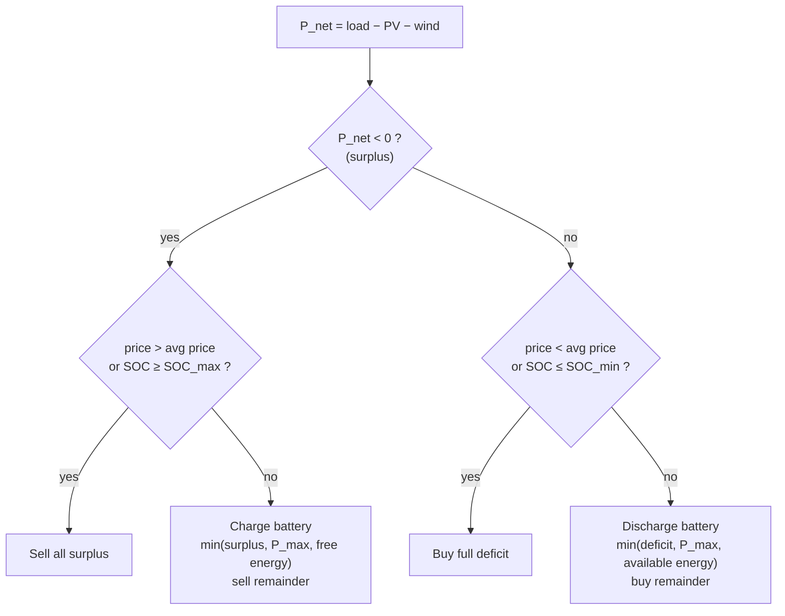
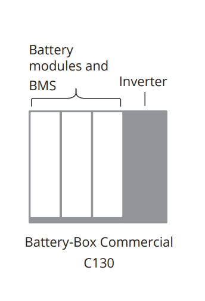

# Grid-Tied Hybrid Energy System (PV + Wind + Battery) — MATLAB Simulation

| | |
|---|---|
| **Status** | Complete as a simulation study (2026). Not reproducible from this repository: the original input data set is not included. |
| **Context** | Academic — *Sistemas de Energia Elétrica* (Power Systems), University of Beira Interior |
| **Author** | Alexandre Saraiva (individual report) |
| **Nature of evidence** | **Simulation only.** No hardware was built or measured. |
| **Evidence** | [Report (PT, PDF)](HRSsimulationREPORT.pdf) · [original script](legacy/Matlab_see_code.m) · [modular code](src/) · [tests](tests/test_hres.m) |

---

## Objective

Size a grid-connected hybrid system for a small load (average ≈ 5 kW), simulate it hourly
over one year, and dispatch battery and grid with a rule-based energy management system (EMS)
that uses the battery state of charge (SOC) and a dynamic electricity price.


## System configuration (from the report)

| Subsystem | Model | Rating |
|---|---|---|
| PV | 125 × Sharp ND-R250A5 (5 series × 25 parallel) | 31.25 kWp |
| Wind | 4 × Bergey BWC XL.1 | 4 × 1.2 kW = 4.8 kW |
| Battery | BYD Battery-Box Commercial C130 | 131 kWh nominal, 88 kW max. power, SOC window 20–90 % → 91.7 kWh usable |
| Grid | Unlimited import/export | — |
| Load | Hourly profile from the data set | ≈ 5 kW average |

## Model assumptions

- Time step of 1 h. Within a step, power [W] and energy [Wh] are numerically equal.
- **PV:** NOCT cell-temperature model, linear temperature derating, MPPT efficiency 0.95, no other losses (soiling, wiring, inverter, shading).
- **Wind:** cubic power curve between cut-in (2 m/s) and rated speed (13 m/s), rated power up to cut-out (20 m/s). No hub-height correction or air-density correction.
- **Battery:** energy-reservoir model, 95 % charge and 95 % discharge efficiency, power limit 88 kW. No ageing, self-discharge or temperature effects.
- **Grid:** always available, unlimited. Loss of power supply probability (LPSP) is 0 % by construction.
- The battery is never charged from the grid.

## Units

| Quantity | Unit |
|---|---|
| Power | W internally, kW in reports |
| Energy | Wh internally, kWh/MWh in reports |
| Irradiance | W/m² |
| Wind speed | m/s |
| Temperature | °C |
| SOC | % of nominal capacity |
| Price | source unit ÷ 1000; the original unit is unverified, see [data/README.md](data/README.md) |

## Inputs and outputs

**Inputs:** hourly `G`, `wind`, `load`, `temp`, `price`. The format and validity checks are described in [data/README.md](data/README.md).

**Outputs** (`simulate_system.m`): time series `Ppv`, `Pwind`, `P_net`, `Pbuy`, `Psell`, `Pbatt`
(>0 discharge, <0 charge) and `SOC`. `summarize_results.m` computes the annual indicators
printed by the original script.

## Energy balance

At the AC bus, at every hour:

```
P_load = P_pv + P_wind + P_buy − P_sell + P_batt
```

Battery stored energy:

```
E(h+1) = E(h) + η_c · P_charge − P_discharge / η_d   (then limited to [SOC_min, SOC_max])
```

## EMS logic



The average price is a moving average over the previous 120 h (5 days) including the current hour.

## Battery constraints

| Constraint | Value | Enforced by |
|---|---|---|
| SOC window | 20 % ≤ SOC ≤ 90 % | `battery_model.m` clamp; asserted in `check_results.m` |
| Power | \|P_batt\| ≤ 88 kW | `ems_controller.m`; asserted in `check_results.m` |
| No grid charging | P_batt < 0 ⇒ P_buy = 0 | asserted in `check_results.m` |
| Energy accounting | ΔE = stored − withdrawn + clamp | asserted in `check_results.m` |

## Reported results (from the original data set)

These figures come from the report, Table 5.1. They cannot be reproduced here (see [Reproducibility](#reproducibility)).

| Indicator | Value |
|---|---|
| Annual load energy | 46.86 MWh |
| Renewable energy generated | 42.19 MWh |
| Grid import / export | 14.89 MWh / 9.82 MWh |
| Battery charge / discharge (AC side) | 4.57 MWh / 4.16 MWh |
| Hours with battery use | 2704 h |
| Final SOC | 20.69 % |
| Usable battery energy / autonomy at 5 kW | 91.7 kWh / 18.3 h (calculated, not simulated) |

**Consistency check** on the published figures, done in this review:
- *AC bus.* 42 186.92 + 14 892.88 − 9 817.40 + 4 164.08 − 4 565.98 = 46 860.49 kWh, equal to the
  load energy. The bus balance closes.
- *Battery.* Stored 4 565.98 × 0.95 = 4 337.68 kWh, withdrawn 4 164.08 / 0.95 = 4 383.24 kWh,
  net −45.56 kWh. The SOC change from 50 % to 20.69 % corresponds to −38.40 kWh.
  The **7.16 kWh** difference was created by the SOC clamp; see the issue below.
- *Load.* 46.86 MWh corresponds to a 5.35 kW average. The report's sizing section uses 5 kW (43.8 MWh).

## Known model issues

| # | Issue | Effect | Status |
|---|---|---|---|
| 1 | The discharge limit uses the available energy *without* discharge efficiency (`min(deficit, P_max, E_avail)`), but the battery loses `P/η_d`. When this limit is active the SOC drops below SOC_min, and the clamp then puts the missing energy back. | Energy is created without a source: 7.16 kWh/year (≈ 0.17 % of the energy discharged) in the reported run. | Reproduced by default for comparability. Set `p.ems.efficiency_aware_discharge_limit = true` to remove it. |
| 2 | The PV temperature coefficient is named `a_voc` in the original script (−0.0029 /°C), but it is applied to power. | If this is the module's V_oc coefficient, PV output at high cell temperature is overestimated. | Unverified. The datasheet is not included in the repository. |
| 3 | The price unit is unclear: the report prints an average of 6.6×10⁻⁶ EUR/kWh. | Dispatch is unaffected (comparisons only). Cost indicators would be wrong. | Documented; no cost indicators computed. |
| 4 | Turbine and PV datasheet parameters are not included in the repository. | Parameter values cannot be checked from the repository. | TODO: add datasheet references. |

## Reproducibility

The original hourly data set `Data_T.mat` **is not in this repository** and has never been
committed. Its source is not documented. See [data/README.md](data/README.md) for the expected format.

| Script | Data | Purpose |
|---|---|---|
| `legacy/Matlab_see_code.m` | `Data_T.mat` in the current folder | Original script, unchanged (Portuguese identifiers). This is the version used for the report. |
| `examples/run_original_dataset.m` | `data/Data_T.mat` (not included) | Modular code on the original data |
| `examples/run_example.m` | **Synthetic** data from `generate_example_data.m` | Shows that the code runs end to end. Its numbers are **not** report results. |
| `tests/test_hres.m` | Synthetic | Unit tests, constraint checks, and a regression test that compares the modular code with the legacy script sample by sample |

```matlab
cd grid-tied-hybrid-energy-system
run examples/run_example.m
results = runtests('tests/test_hres.m')
```

**Verification status of this refactor:** MATLAB and Octave were not available when the
refactor was made. All `.m` files pass a syntax/lint check with MISS_HIT (`mh_lint`).
**None of the MATLAB code in `src/`, `examples/` or `tests/` has been executed yet.**
Run `tests/test_hres.m` in MATLAB (R2018b or later) before relying on it.

## Layout

```
grid-tied-hybrid-energy-system/
├── HRSsimulationREPORT.pdf
├── legacy/Matlab_see_code.m        original script (unchanged)
├── src/                            hres_default_params, pv_model, wind_model, ems_controller,
│                                   battery_model, simulate_system, check_inputs, check_results,
│                                   summarize_results, print_summary, plot_results
├── examples/                       run_example, run_original_dataset, generate_example_data
├── tests/test_hres.m
├── data/README.md                  expected input format; Data_T.mat not included
└── images/
```

## Component images

| PV module (Sharp ND-R250A5) | Wind turbine (Bergey BWC XL.1) | Battery (BYD C130) |
|---|---|---|
|  |  |  |

The images are manufacturer product images, used for identification only.
