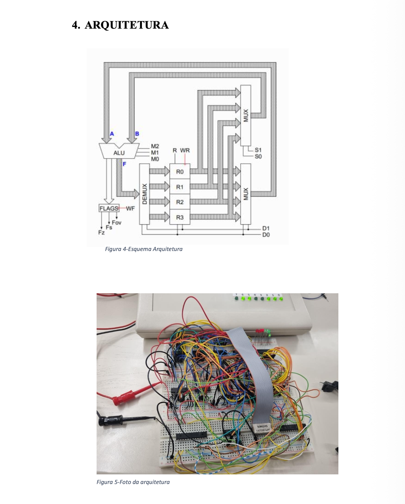

# 4-bit Datapath and Controller in TTL + GAL22V10

| | |
|---|---|
| **Status** | Partial. The ALU was tested in hardware. The controller was programmed but not functionally validated (report §8.2). |
| **Context** | Academic — *Microprocessadores* (Microprocessors), University of Beira Interior, 2026 |
| **My contribution** | Single-author report (Alexandre Saraiva), although the text refers to "we"; task split not documented. |
| **Evidence** | [Report (PT, PDF)](MICRO1lab25.pdf) · [architecture diagram and photo](architecture-diagram.png) |
| **Source code** | WinCUPL listings are in the report only; no `.pld` files are in this folder. |

---

## Architecture

| Block | Implementation |
|---|---|
| Input register, accumulator, flags register | 74LS173 |
| Register file (4 × 4 bit) | 74LS670 |
| ALU | GAL22V10 (Boolean equations in WinCUPL) |
| Controller (FSM) | GAL22V10 (WinCUPL): register writes, memory access, ALU operation select, result store, flag update |

Operations: add, subtract (two's complement), increment, decrement.
Flags: zero (FZ), carry (FC) and overflow (FOV).

## Test results (from report §8)

| Test | Result |
|---|---|
| ALU tested in isolation (operands A, B; controls M1, M0; outputs F3..F0, FZ, FC, FOV): A + B with carry and overflow, A − B, A + 1, A − 1, zero detection | Pass, for all cases reported |
| Controller integrated with the datapath | **Not tested.** Not completed because of time. |

The report does not include a test vector table (operand values and expected and observed outputs).

## Improvements (not implemented)

- Write an exhaustive ALU test vector table (2⁴ × 2⁴ × 4 operations) and generate the expected results in software.
- Simulate the controller FSM in WinCUPL/WinSim before hardware integration, and step through it at a slow clock with LED probes on each control line.
