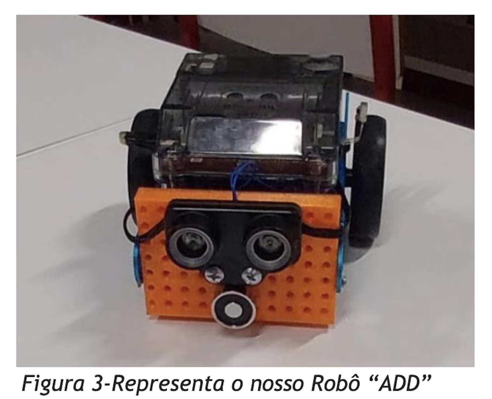

# mBot2 Adaptation for Robot@Factory Lite

| | |
|---|---|
| **Status** | Partial. The first mission sequence was achieved; the full competition task was not. |
| **Context** | Academic — *Robótica* (Robotics), University of Beira Interior, 2024 |
| **Team** | Alexandre Saraiva, Daniela Fernando, Diogo Soares |
| **My contribution** | Actuators: electromagnet driver circuit (schematic, soldered and insulated board) and the SolidWorks mount, 3D printed. I also worked on an infrared sensor interface, which was not completed. Programming was done by a teammate (report, Conclusion). |
| **Evidence** | [Report (PT, PDF)](RelatorioRoboticaADD.pdf) · [video](https://www.youtube.com/watch?v=6UiQEKMYRqw) · [photo](robotADD.png) |

---

## Problem

Adapt a Makeblock mBot2 (CyberPi controller, quad RGB line sensor, ultrasonic sensor,
encoder motors) for the Robot@Factory Lite task. The robot has to leave the start area,
pick up a box, deliver it to a target and continue through the factory map.

## Constraints

- Fixed platform: the chassis, sensors and motors came pre-assembled.
- Grip mechanism: no gripper is included, so a box-towing method had to be added.
- One semester, three people, with the work split into actuators, sensors and programming.

## Approach

| Area | What was done |
|---|---|
| Actuation | An electromagnet was added to tow the box. A driver circuit was designed, soldered on a perfboard and insulated. A SolidWorks mount keeps the magnet clear of the ultrasonic sensor; it was 3D printed. |
| Localization concept | The track was divided into equal grid cells and encoded as a matrix (0 = free, 1 = obstacle) so the robot could be located by coordinates. |
| Path planning (attempted) | A\* on the grid matrix |
| Programming | A Python version was attempted first, with AI assistance, and made little progress. The first round was then programmed as Scratch blocks in mBlock. |

## Observed limitation

The robot often failed to detect the right-hand (R2) and left-hand (L2) intersections while
correcting its position on the line. Navigation that depends on counting intersections then
lost track of position. The infrared sensor was not integrated: the team could not resolve the
interface between the CyberPi and the sensor hardware, or the analog/digital conversion.

## Final engineering decision

A\* was abandoned because of time and complexity. The final program used **rule-based
navigation**: a fixed sequence of line-following and turn actions for the first round.

## Results

| Mission step | Result |
|---|---|
| Leave the start zone | Achieved |
| Pick up the box with the electromagnet at point A | Achieved |
| Deliver to destination 1 and release | Achieved |
| Return to pickup point B | Achieved |
| Remaining competition path | **Not achieved.** Intersection detection was unreliable. |

The report concludes that the team did not reach the goal of a robot fully able to take part in
the competition. No success rate, run count or timing data was recorded.

## Lessons learned

- **Validate sensing before planning.** The planner depended on reliable intersection detection.
  Characterizing the line sensor first (detection rate against speed and lighting) would have
  exposed the limitation earlier.
- **Adapt the algorithm to the platform.** On this platform and timeline, a simple state machine
  with robust event detection was more achievable than global path planning.
- **Record test runs.** Logging each run (pass/fail per segment and the cause of failure) would
  have turned the observations above into data.
