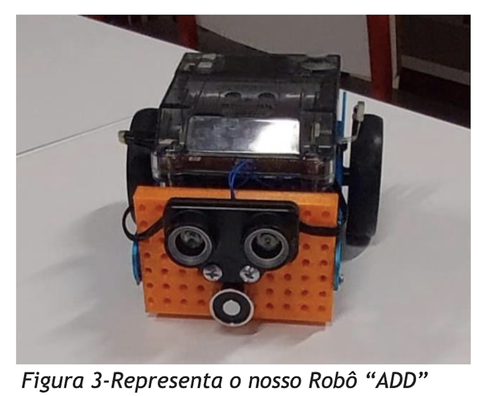

#  Robotics Project — mBot2 Robot@Factory Lite

Autonomous mobile robot developed using the **mBot2 platform** for the **Robot@Factory Lite robotics competition**.

This project was developed during the **Robotics course** of the Electrical and Computer Engineering degree at the **University of Beira Interior**.

---

#  Project Demonstration

Video demonstration of the robot:

https://www.youtube.com/watch?v=6UiQEKMYRqw

---

#  Project Goal

The objective was to design and program an autonomous robot capable of navigating an industrial-style factory map and transporting objects.

The robot needed to:

• Navigate autonomously through the factory layout  
• Detect paths and intersections  
• Pick up a box using an electromagnet  
• Deliver the object to the correct destination  

The challenge simulates **real industrial automation environments**.

---

#  Robot Platform

The project used the **mBot2 robotics platform** developed by Makeblock.

Main controller:

CyberPi microcontroller

Capabilities include:

• WiFi connectivity  
• Sensor integration  
• Motor control with encoders  
• Python and block programming support  

---

#  Hardware Components

Main hardware used in the project:

• mBot2 robot platform  
• CyberPi controller  
• Ultrasonic distance sensor  
• Quad RGB line follower sensor  
• DC motors with encoders  
• Custom electromagnet actuator  
• Custom 3D printed mount (SolidWorks)

The electromagnet was designed to tow and transport the factory box.

---

#  Software & Programming

The robot was programmed using:

• mBlock software  
• Scratch based control logic  
• Path control algorithms  

An attempt was made to implement the **A* pathfinding algorithm**, but due to time constraints and hardware limitations the final implementation used rule-based navigation.

---

#  Control Strategy

The factory map was divided into grid cells to represent the environment.

Each cell represented:

0 → Free path  
1 → Obstacle  

This approach allowed the robot to determine its position and plan movement through the factory map.

---

#  Results

The robot successfully completed the first mission sequence:

1️⃣ Leave starting area  
2️⃣ Pick up box using electromagnet  
3️⃣ Navigate to delivery point  
4️⃣ Drop the box  
5️⃣ Return to pickup area  

However, limitations in sensor accuracy prevented full completion of the competition path.

---

#  Skills Demonstrated

This project demonstrates practical experience with:

• Robotics systems  
• Sensor integration  
• Embedded programming  
• Control systems  
• CAD design  
• Electronics prototyping  
• Autonomous navigation

---
## Full Project Report

You can read the complete academic report here:

 [Robotics Project Report](RelatorioRoboticaADD.pdf)

---

#  Academic Context

Course: Robotics  
University: University of Beira Interior  
Degree: Electrical and Computer Engineering

---

#  Author

Alexandre Saraiva  

Electrical and Computer Engineering Student  

LinkedIn  
https://linkedin.com/in/alexandre-saraiva12

GitHub  
https://github.com/ALEXs-G
