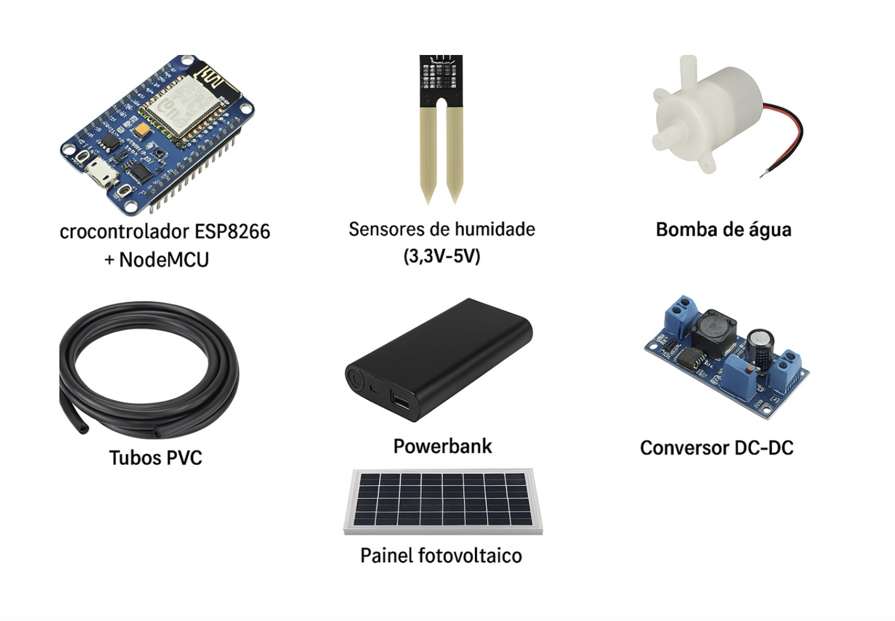
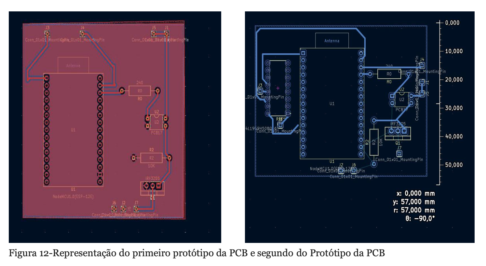

#  Smart Self-Sustainable Irrigation System

An autonomous irrigation system powered by solar energy designed to optimize water consumption in agricultural environments using IoT technology.

Developed during the Electrical and Computer Engineering degree at the **University of Beira Interior**.

Authors: Alexandre Saraiva, Diogo Soares, Suennia Ramos

---

#  Project Overview

This project presents a **smart irrigation system** capable of automatically watering plants based on soil moisture conditions.

The system integrates:

• Soil moisture sensing  
• Autonomous solar power supply  
• IoT monitoring through cloud services  
• Automated water pump control  

The objective is to **reduce water waste while maintaining optimal plant irrigation conditions**.

The system was designed for **oregano cultivation**, but can easily be adapted to other crops.

---

#  Demonstration

Video demonstration of the working prototype:

https://youtu.be/8IsAK37pPTY

---

#  System Architecture

The system consists of four main subsystems:

### 1️ Sensing Layer

Sensors collect environmental data:

• Soil Moisture Sensor  
• Water Level Sensor  

These sensors monitor the conditions required for irrigation.

---

### 2️ Processing Layer

An **ESP8266 microcontroller** processes sensor data and decides whether irrigation should be activated.

Responsibilities:

• Reading sensor values  
• Decision logic for irrigation  
• Communication with the cloud platform  
• Power management

---

### 3️ Actuation Layer

A **water pump** is activated automatically when soil moisture falls below the defined threshold.

This ensures plants receive water only when needed.

---

### 4️ IoT Monitoring Layer

Sensor data is transmitted to the **ThingSpeak cloud platform**.

This enables:

• Remote monitoring  
• Data visualization  
• Historical data analysis

ThingSpeak dashboard:

https://thingspeak.mathworks.com/channels/2914672

---

#  Hardware Components

Main hardware used in the project:

• ESP8266 microcontroller  
• Soil moisture sensor  
• Water level sensor  
• Water pump  
• Solar panel  
• Battery module  
• Custom PCB board  
• 3D printed enclosure

---

#  Software Technologies

Programming and development tools used:

• C / C++ (Arduino IDE)  
• IoT communication using ESP8266 WiFi  
• MATLAB ThingSpeak platform  
• SolidWorks (mechanical design)  
• KiCad (PCB design)

---

#  Control Logic

The irrigation logic follows a simple control algorithm:

1️ Read soil moisture sensor  
2️ Compare value with threshold  
3️ If soil is dry → activate pump  
4️ If soil moisture adequate → keep pump off  
5️ Send sensor data to ThingSpeak

---

#  Power System

The system is **fully autonomous** using renewable energy.

Energy source:

• Solar panel  
• Rechargeable battery

This allows the system to operate in remote agricultural environments without external power supply.

---

#  Results

The prototype successfully demonstrated:

• Automated irrigation  
• Remote monitoring  
• Stable operation using solar power

Estimated **water consumption reduction: ~60%**

---

#  Possible Improvements

Future developments could include:

• AI-based irrigation prediction  
• Weather data integration  
• Mobile application monitoring  
• Multiple sensor nodes (distributed irrigation network)  
• Edge AI for crop health monitoring

---

#  Prototype

Example prototype implementation:

---
#  Full Project Report

You can read the complete academic report here:

➡️ [Autonomous-smart-irrigation-system](RelatorioSISTEMAIrrigacaoFinal.pdf)

#  Academic Context

Course: Electrical and Computer Engineering  
University: University of Beira Interior  
Course Unit: Electrical Project

---

#  Author

Alexandre Saraiva  

Electrical and Computer Engineering Student  

LinkedIn  
https://linkedin.com/in/alexandre-saraiva12

GitHub  
https://github.com/ALEXs-G

