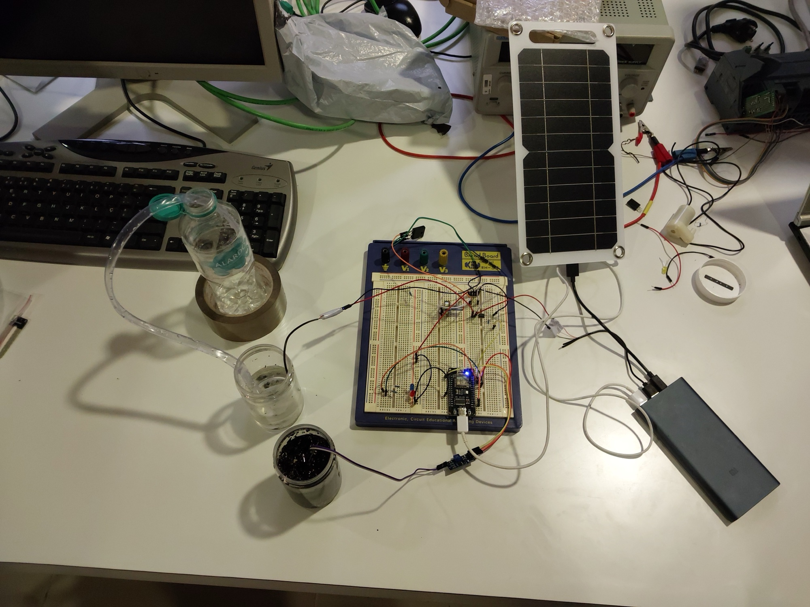
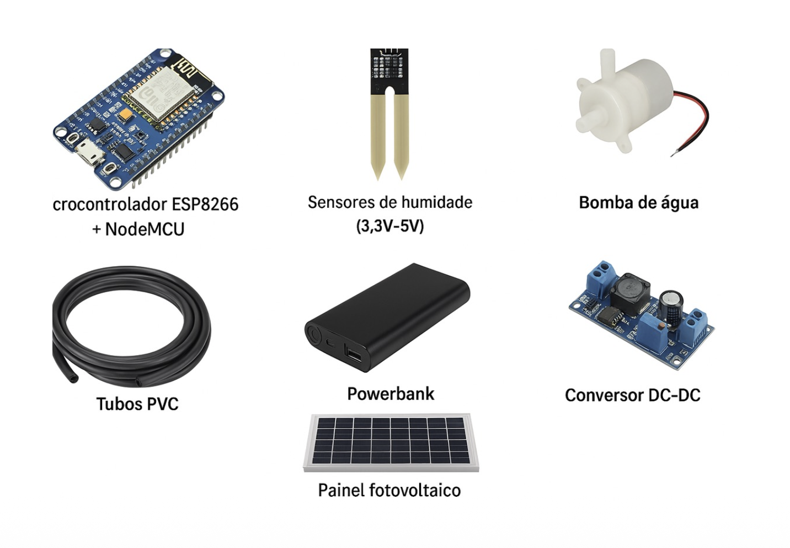
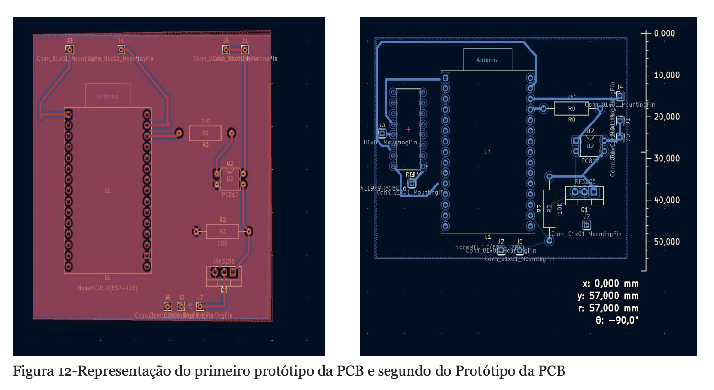

# Smart Self-Sustainable Irrigation System

An autonomous irrigation system powered by solar energy, designed to optimize water consumption using IoT technology.

| | |
|---|---|
| **Status** | Partial — prototype demonstrated in the lab; see [Results](#results) for limitations |
| **Context** | Academic — Electrical Engineering Project, University of Beira Interior, June 2025 |
| **Team** | Alexandre Saraiva, Diogo Soares, Suennia Ramos |
| **My contribution** | Co-author (3-person team project) |
| **Evidence** | [Report (PT, PDF)](report.pdf) · [firmware](code.ino) · [video](https://youtu.be/8IsAK37pPTY) · [ThingSpeak channel](https://thingspeak.mathworks.com/channels/2914672) |

---

## Project Overview

This project presents a **smart irrigation system** capable of automatically watering plants based on soil moisture conditions.

The system integrates:

- Soil moisture sensing
- Autonomous solar power supply
- IoT monitoring through cloud services
- Automated water pump control

The objective is to **reduce water waste while maintaining adequate plant irrigation conditions**.

The system was designed for **oregano cultivation**, but can be adapted to other crops.

---

## Demonstration

Video demonstration of the working prototype: https://youtu.be/8IsAK37pPTY

---

## System Architecture

The system consists of four main subsystems:

### 1. Sensing Layer

Sensors collect environmental data:

- Soil moisture sensor
- Water level sensor

Both are read through a CD4053B analog multiplexer, because the ESP8266 has a single analog input.

### 2. Processing Layer

An **ESP8266 microcontroller** processes sensor data and decides whether irrigation should be activated.

Responsibilities:

- Reading sensor values
- Decision logic for irrigation
- Communication with the cloud platform
- Power management (deep sleep between cycles)

### 3. Actuation Layer

A **water pump** is activated automatically when soil moisture falls below the defined threshold and enough water is available in the reservoir.

### 4. IoT Monitoring Layer

Sensor data is transmitted to the **ThingSpeak cloud platform** for remote monitoring, data visualization and historical data analysis.

ThingSpeak dashboard: https://thingspeak.mathworks.com/channels/2914672

---

## Hardware Components

- ESP8266 microcontroller (NodeMCU)
- Soil moisture sensor
- Water level sensor
- CD4053B analog multiplexer
- Water pump with optocoupler driver
- Solar panel
- Battery module (power bank)
- Custom PCB (designed in KiCad)
- 3D printed enclosure

---

## Software Technologies

- C / C++ (Arduino IDE)
- IoT communication using ESP8266 Wi-Fi
- MATLAB ThingSpeak platform
- SolidWorks (mechanical design)
- KiCad (PCB design)

---

## Control Logic

The irrigation logic follows a simple control algorithm:

1. Read the water level and soil moisture sensors
2. If the water level is below the minimum → do not water
3. If soil moisture is below 60 % → activate the pump
4. Keep watering until moisture reaches 63 % or the water level drops too low
5. Send sensor data to ThingSpeak
6. Enter deep sleep, then repeat

---

## Power System

The system is designed to be **autonomous** using renewable energy:

- Solar panel
- Rechargeable battery

---

## Results

The prototype demonstrated:

- Automated irrigation
- Remote monitoring

Limitations reported: during the final demonstration the power supply between the power bank and the ESP8266 failed, and the system was only tested indoors (pot of soil), not in long-term outdoor operation.

---

## Possible Improvements

- AI-based irrigation prediction
- Weather data integration
- Mobile application monitoring
- Multiple sensor nodes (distributed irrigation network)
- Edge AI for crop health monitoring

---

## Configuration

Credentials are not stored in the code. Copy `secrets.example.h` to `secrets.h` (ignored by git) and fill in your Wi-Fi and ThingSpeak values before compiling `code.ino`.
