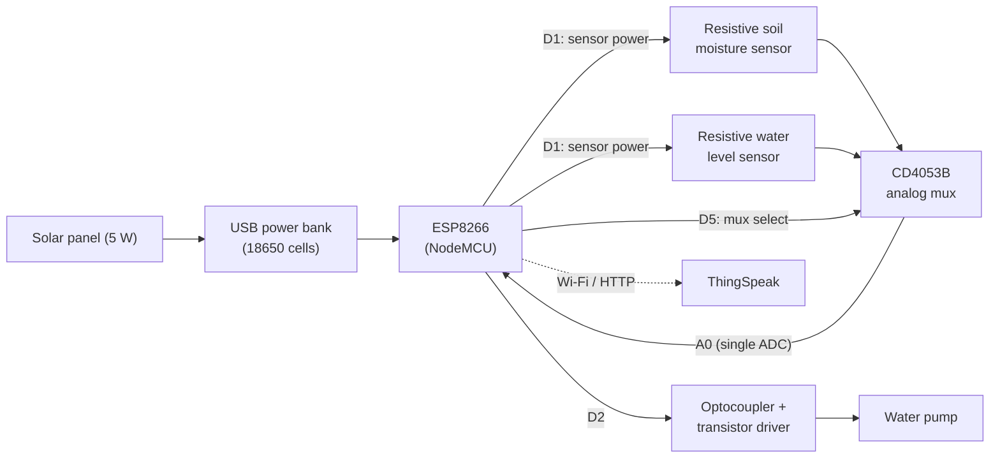
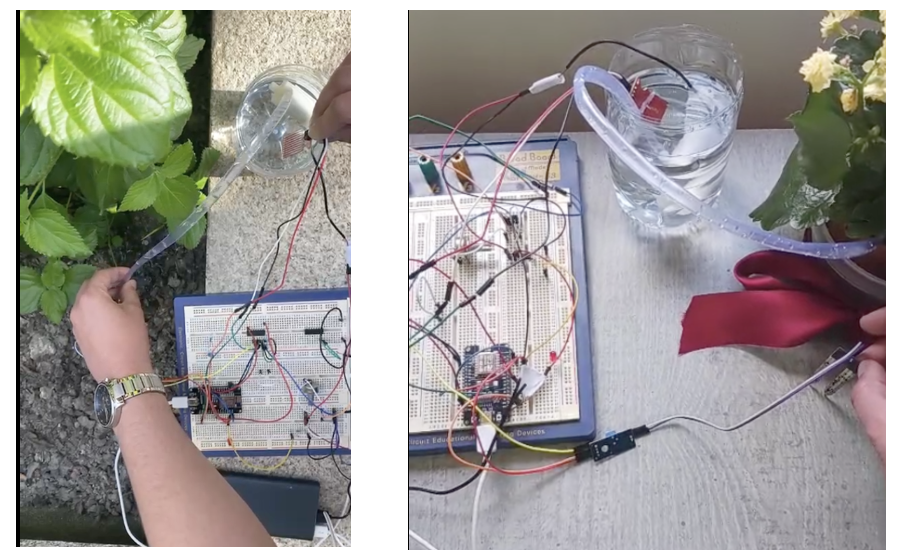
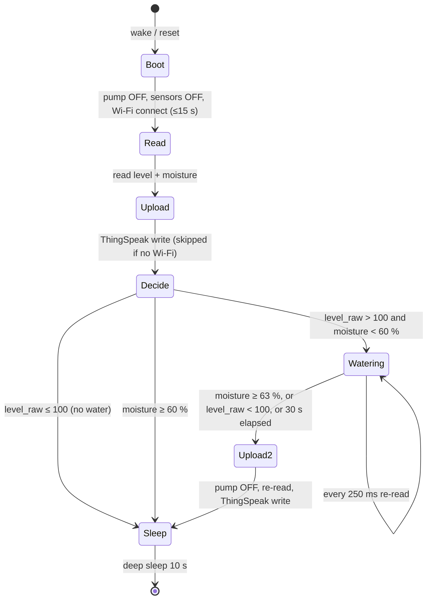

# Smart Self-Sustaining Irrigation System (ESP8266)

| | |
|---|---|
| **Status** | Partial. A working prototype was demonstrated in the lab. It is not continuously stable; see [Known issues](#known-issues-observed). |
| **Context** | Academic — *Introdução ao Projeto Eletrotécnico* (Electrical Engineering Project), University of Beira Interior, June 2025 |
| **Team** | Alexandre Saraiva, Diogo Soares, Suennia Ramos |
| **My contribution** | TODO (owner): state individual responsibilities. The report does not attribute tasks to team members. |
| **Evidence** | [Report (PT, PDF)](RelatorioSISTEMAIrrigacaoFinal.pdf) · [firmware](firmware/irrigation_controller/irrigation_controller.ino) · [video](https://youtu.be/8IsAK37pPTY) · [ThingSpeak channel](https://thingspeak.mathworks.com/channels/2914672) · [photos](images/) |

---

## System objective

Water a potted plant (oregano was the target crop) automatically when the soil is dry. The
pump runs only when the reservoir holds water. Soil moisture and reservoir level are sent
to ThingSpeak, and the node runs from a solar-charged battery.

## Requirements

From the report (section 3.1 and the objectives in 1.3):

| ID | Requirement | Verification status |
|---|---|---|
| IRR-R1 | Monitor soil moisture | Demonstrated (report §4.8, video) |
| IRR-R2 | Detect reservoir water level; inhibit the pump when low | Demonstrated qualitatively (report §4.8) |
| IRR-R3 | Control the pump automatically (start < 60 %, stop ≥ 63 %) | Demonstrated qualitatively (report §4.8) |
| IRR-R4 | Send data to an IoT platform (ThingSpeak) | Demonstrated (report figs. 5, 8) |
| IRR-R5 | Run autonomously from solar energy | **Not verified.** Daily consumption of ≈ 1.5 Wh was *estimated*, not measured. The supply failed during the final demonstration. |
| IRR-R6 | Test and validate in the real (outdoor) environment | **Not done.** Tested indoors with a pot of soil (report §1.2, §3.5) |

## Architecture


```mermaid
flowchart LR
    PV["Solar panel (5 W)"] --> PB["USB power bank<br/>(18650 cells)"]
    PB --> MCU["ESP8266<br/>(NodeMCU)"]
    SM["Resistive soil<br/>moisture sensor"] --> MUX["CD4053B<br/>analog mux"]
    WL["Resistive water<br/>level sensor"] --> MUX
    MUX -->|"A0 (single ADC)"| MCU
    MCU -->|"D5: mux select"| MUX
    MCU -->|"D1: sensor power"| SM & WL
    MCU -->|"D2"| OPTO["Optocoupler +<br/>transistor driver"] --> PUMP["Water pump"]
    MCU -.->|"Wi-Fi / HTTP"| TS["ThingSpeak"]
```

The connections are taken from the firmware pin map and from report §4.2–4.3. The report's
schematic (fig. 10) omits the mux and the level sensor.

## Hardware

| Function | Part | Notes |
|---|---|---|
| Controller | ESP8266 NodeMCU | One ADC input (A0), hence the mux |
| Analog mux | CD4053B | Selects moisture or level sensor |
| Sensors | Resistive soil moisture sensor, resistive water-level sensor | Powered only during reads (D1) |
| Pump driver | Optocoupler + transistor | Report text: BJT with R1 = 240 Ω (LED), R2 = 20 kΩ (base). The KiCad layout shows a PC817 and an IRF3205 MOSFET with 240 Ω / 10 kΩ. The two documents disagree, and which one was built is not documented. |
| Power | 5 W solar panel → USB power bank (18650) | §2.7 (§4.1 writes "5 V"; panel datasheet not included) |
| PCB | KiCad layout, two iterations ([image](images/PCB.jpeg)) | Fabrication not documented. The report lists "print the PCB" as future work. |
| Enclosure | SolidWorks design, 3D printed ([image](images/Boxe.jpeg)) | The report notes it came out too small for the electronics |



*Breadboard prototype during functional tests.* The image [visual.jpeg](images/visual.jpeg)
is a conceptual illustration, not a photograph of the hardware.

## Firmware architecture

Single Arduino sketch: [`firmware/irrigation_controller/irrigation_controller.ino`](firmware/irrigation_controller/irrigation_controller.ino).
Each wake-up runs `setup()` and then one pass of `loop()`, which ends in deep sleep. The
ESP8266 resets on wake, so the cycle starts again from `setup()`.

| Function | Responsibility |
|---|---|
| `lerSensores()` | Power sensors, read level (mux LOW) then moisture (mux HIGH), power sensors off |
| `mediaAnalogica()` | Select mux channel, wait 100 ms to settle, average 5 ADC samples |
| `converter*Percentagem()` | Map raw ADC to 0–100 % with `map()` + `constrain()` |
| `regarAteHumidadeIdeal()` | Pump-on loop with the stop conditions listed below |
| `ligarWiFi()` | Connect with a 15 s timeout; returns success |
| `enviarParaThingSpeak()` | Write fields 1 (moisture %) and 2 (level %); checks the HTTP code |
| `desligarSistema()` | Pump off, sensors off |

> **Version note:** the firmware in this repository is a later revision than the code in
> Annex A of the report. The **30 s watering timeout** and the **5-sample averaging** exist
> only in the repository version. Nothing documents that this revision ran on the
> demonstrated hardware. The report's observations below refer to the Annex A code.

Credentials live in a git-ignored `secrets.h`. See [Configuration](#configuration).

## Control logic


```mermaid
stateDiagram-v2
    [*] --> Boot: wake / reset
    Boot --> Read: pump OFF, sensors OFF, Wi-Fi connect (≤15 s)
    Read --> Upload: read level + moisture
    Upload --> Decide: ThingSpeak write (skipped if no Wi-Fi)
    Decide --> Sleep: level_raw ≤ 100 (no water)
    Decide --> Sleep: moisture ≥ 60 %
    Decide --> Watering: level_raw > 100 and moisture < 60 %
    Watering --> Watering: every 250 ms re-read
    Watering --> Upload2: moisture ≥ 63 %, or level_raw < 100, or 30 s elapsed
    Upload2 --> Sleep: pump OFF, re-read, ThingSpeak write
    Sleep --> [*]: deep sleep 10 s
```

## Fault handling

These behaviours are implemented in the repository firmware and were verified by reading the source.

| Failure condition | Detection | System response | In report version? |
|---|---|---|---|
| Reservoir empty at cycle start | `nivelBruto <= 100` | Watering not authorized; pump stays off | Yes |
| Reservoir runs dry while watering | `nivelBruto < 100` on each 250 ms iteration | Pump off, exit watering loop | Yes |
| Moisture never reaches target | `millis() - inicioRega > 30000` | Pump off ("timeout") | **No** |
| Wi-Fi unavailable | `WiFi.status()` not connected after 15 s | Upload skipped, logged; local irrigation control continues | Yes (no return code) |
| ThingSpeak write rejected | HTTP code ≠ 200 | Logged to serial; no retry, no buffering | Yes |
| ADC noise | — | 5-sample average per reading | **No** |
| Actuator safe state | — | Pump commanded off at boot, at the start of each cycle and before deep sleep | Yes |

**Not handled** (review findings, untested):
- **No sensor plausibility check.** A disconnected or failed moisture sensor is not
  detected. If its reading maps to "dry", the node waters until the level check or the
  timeout stops it. The timeout exists only in the repository version.
- **Possible ThingSpeak rate-limit conflict.** A watering cycle writes twice in one wake-up,
  and the base cycle is ≈ 10 s of sleep plus the active time. Free ThingSpeak accounts reject
  updates closer than 15 s apart, so the second write of a short cycle may fail. Not tested.
- **Deep-sleep wiring not documented.** Wake-up from `ESP.deepSleep()` needs GPIO16 (D0)
  wired to RST. The schematic and PCB documentation do not show this connection.
- **Threshold comparisons differ.** The cycle start uses `<= 100` and the watering loop uses
  `< 100`. The effect is negligible, but the two checks should share one definition.

## Verification

### Test matrix

| Test ID | Requirement | Condition / stimulus | Expected result | Observed result | Status |
|---|---|---|---|---|---|
| IRR-T01 | IRR-R1, R3 | Dry soil (< 60 %), water available | Pump starts | Pump activated automatically below 60 % (report §4.8) | Pass (qualitative, report version) |
| IRR-T02 | IRR-R3 | Watering in progress, moisture rises | Pump stops at ≥ 63 % | Pump stopped at the 63 % target (report §4.8) | Pass (qualitative, report version) |
| IRR-T03 | IRR-R2 | Dry soil, reservoir below threshold | Pump does not start | "System only operated when water was available" (report §4.8) | Pass (qualitative; no test record) |
| IRR-T04 | IRR-R2 | Reservoir empties during watering | Pump stops | Not formally documented | Not tested |
| IRR-T05 | IRR-R3 | Moisture target unreachable (e.g. probe in air) | Pump stops after 30 s | Not formally documented | Not tested (repo version only) |
| IRR-T06 | IRR-R4 | Wi-Fi available | Fields 1–2 updated on the channel | Data visible on the ThingSpeak dashboard (report figs. 5, 8) | Pass |
| IRR-T07 | IRR-R4 | Wi-Fi access point off | Upload skipped; irrigation still works | Not formally documented | Not tested |
| IRR-T08 | — | Normal cycle | Deep sleep 10 s, then a new cycle | Read/send/sleep cycling observed (report §4.8) | Pass (qualitative) |
| IRR-T09 | IRR-R5 | Battery + solar only, multi-day | Continuous operation | Supply failure between power bank and ESP8266 during the final demo (report §4.8) | **Fail** |
| IRR-T10 | IRR-R6 | Outdoor deployment, long duration | Stable operation | Not performed | Not tested |

Sensor calibration was done empirically to set the thresholds (report §3.5). The raw ADC
calibration points (level 0–465, moisture 1024 = dry, 0 = wet) are in the firmware. No
calibration data set is documented.

### Known issues (observed)

From the report (§4.8, ch. 5):
- During the final demonstration the ESP8266 lost power from the power bank. It could not read
  sensors or reach Wi-Fi until near the end of the presentation.
- Small fluctuations in sensor readings and intermittent communication instability.
- Resistive sensors are subject to temperature effects and electrode oxidation.

### Future test cases (not implemented)

- Power budget: measure the current profile (deep sleep, Wi-Fi TX, pump) with a shunt and
  oscilloscope or a power analyser, and replace the 1.5 Wh/day estimate with measured energy per cycle.
- Brown-out test: sweep the supply voltage and record reset behaviour. This targets the power-bank failure mode.
  Note that many USB power banks switch off below a minimum load current, which is consistent with
  a node that spends most of its time in deep sleep. This hypothesis has not been tested.
- Sensor characterization: ADC reading against gravimetric soil moisture, and drift over days.
- Fault injection: disconnect each sensor, block the pump and drop Wi-Fi, then confirm the response.

## Configuration

```bash
cd firmware/irrigation_controller
cp secrets.example.h secrets.h   # then edit Wi-Fi + ThingSpeak values; secrets.h is git-ignored
```

Open `irrigation_controller.ino` in the Arduino IDE with the ESP8266 board package and the
`ThingSpeak` library installed. The sketch stops at compile time if `secrets.h` is missing.
See [SECURITY.md](../SECURITY.md).

The repository firmware has been syntax-checked on a host compiler with stub headers. It has
**not** been compiled for the ESP8266 target, and the revision has not been run on hardware.
