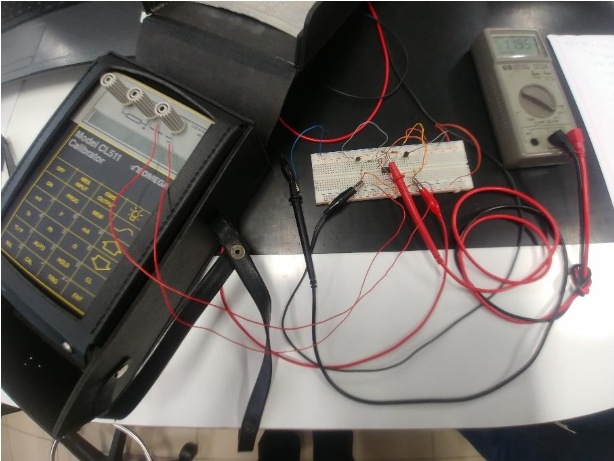

# 🌡️ Thermocouple Temperature Measurement System (Type K)

Design and implementation of a **temperature measurement system using a Type K thermocouple**, including **cold junction compensation** and signal conditioning.

---

## 📸 Experimental Setup



---

## 📄 Project Report

📥 [Download Full Report](REPORTKalexandreEEC.pdf)

---

## 🧠 Overview

This project focuses on measuring temperature in the range:

👉 **0 ºC to 350 ºC**

using a **Type K thermocouple**, combined with a compensation circuit to ensure accurate measurements independent of environmental conditions.

📌 As described in the report  [oai_citation:0‡relatorioTKalexandreEEC .pdf](sediment://file_00000000a010720ab5664c055b044595), the system includes automatic cold junction compensation to isolate the temperature of interest.

---

## ⚙️ System Functionality

### 🌡️ Temperature Measurement
- Uses a **Type K thermocouple**
- Converts temperature differences into voltage

### ❄️ Cold Junction Compensation
- Implemented using **LM335 temperature sensor**
- Ensures output depends only on measured temperature (Tj)

### 🔌 Output Signal
- Voltage range:
  - **0 V → 2.5 V**
- Proportional to temperature

---

## 🏗️ Circuit Design

The system includes:

- Thermocouple (Type K)
- Operational amplifier (signal conditioning)
- LM335 temperature sensor
- Compensation circuit

📌 The output voltage is derived from:

```
Vo = (R1 / R0) * Sk * Tk
```

Where:
- Sk → thermocouple sensitivity
- Tk → measured temperature

---

## 🧮 Component Design

Calculated values:

- **R1 ≈ 175 kΩ**
- **R2 ≈ 243.9 Ω**
- **R3 ≈ 223.4 kΩ**

📌 These values ensure correct scaling and compensation across the temperature range.

---

## 📊 Experimental Results

| Temperature (ºC) | Output Voltage (V) |
|----------------|------------------|
| 0   | 0.119 |
| 50  | 0.468 |
| 100 | 0.825 |
| 150 | 1.178 |
| 200 | 1.523 |
| 250 | 1.870 |
| 300 | 2.228 |
| 350 | 2.586 |

📌 Results show a **linear relationship** between temperature and output voltage.

---

## 📈 Key Observations

- Accurate temperature measurement achieved
- Compensation circuit improves reliability
- System stable across full temperature range

📌 The report concludes that cold junction compensation is essential for precision measurements  [oai_citation:1‡relatorioTKalexandreEEC .pdf](sediment://file_00000000a010720ab5664c055b044595)

---

## 💻 Technologies Used

- Analog electronics
- Sensors (Thermocouple Type K, LM335)
- Signal conditioning
- Instrumentation and measurement

---

## 📚 Academic Context

- 🎓 Electrical and Computer Engineering  
- 🏫 University of Beira Interior  
- 📘 Course: Instrumentation and Measurement  

---

## 👨‍💻 Author

**Alexandre Saraiva**

🔗 LinkedIn  
https://linkedin.com/in/alexandre-saraiva12  

💻 GitHub  
https://github.com/ALEXs-G  

---

## 🚀 Skills Demonstrated

✔ Sensor integration  
✔ Analog circuit design  
✔ Temperature measurement systems  
✔ Signal conditioning  
✔ Engineering calibration techniques  

---

## 🔥 Why This Project Matters

This project demonstrates:

✔ Real-world sensor usage  
✔ Precision measurement systems  
✔ Analog electronics design  
✔ Engineering problem-solving  

---
