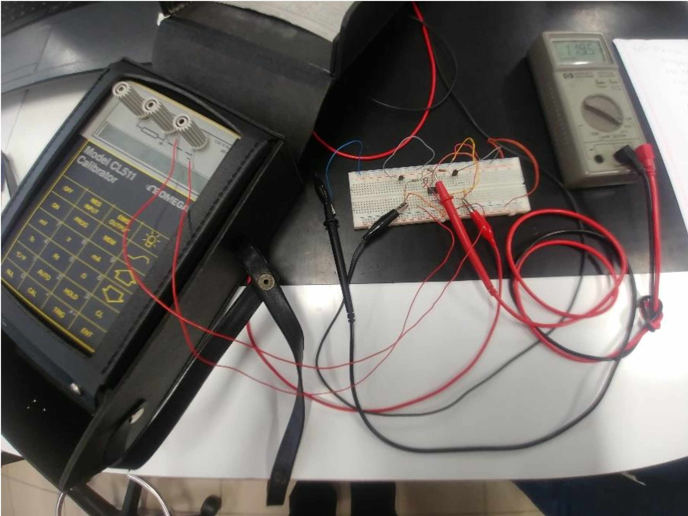

# Thermocouple Temperature Measurement System (Type K)

Design and implementation of a **temperature measurement system using a Type K thermocouple**, including **cold junction compensation** and signal conditioning.

| | |
|---|---|
| **Status** | Complete |
| **Context** | Academic — Instrumentation and Measurement, University of Beira Interior, June 2024 |
| **Team** | Alexandre Saraiva, Diogo Soares |
| **My contribution** | Co-author (2-person lab work) |
| **Evidence** | [Report (PT, PDF)](report.pdf) · setup photo below · measured data in [Experimental Results](#experimental-results) |

---

## Experimental Setup



---

## Overview

This project focuses on measuring temperature in the range:

**0 ºC to 350 ºC**

using a **Type K thermocouple**, combined with a compensation circuit to ensure accurate measurements independent of environmental conditions.

As described in the [report](report.pdf), the system includes automatic cold junction compensation to isolate the temperature of interest.

---

## System Functionality

### Temperature Measurement
- Uses a **Type K thermocouple**
- Converts temperature differences into voltage

### Cold Junction Compensation
- Implemented using **LM335 temperature sensor**
- Ensures output depends only on measured temperature (Tj)

### Output Signal
- Voltage range:
  - **0 V → 2.5 V**
- Proportional to temperature

---

## Circuit Design

The system includes:

- Thermocouple (Type K)
- Operational amplifier (signal conditioning)
- LM335 temperature sensor
- Compensation circuit

The output voltage is derived from:

```
Vo = (R1 / R0) * Sk * Tk
```

Where:
- Sk → thermocouple sensitivity
- Tk → measured temperature

---

## Component Design

Calculated values:

- **R1 ≈ 175 kΩ**
- **R2 ≈ 243.9 kΩ** (R2 = R0 · 0.01 / Sk = 1000 · 0.01 / 41 µV/°C; the report writes "Ω")
- **R3 ≈ 223.4 kΩ**

These values ensure correct scaling and compensation across the temperature range.

---

## Experimental Results

| Temperature (ºC) | Output Voltage (V) |
|----------------|------------------|
| 0   | 0.119 |
| 50  | 0.468 |
| 100 | 0.825 |
| 150 | 1.178 |
| 200 | 1.523 |
| 250 | 1.870 |
| 300 | 2.228 |
| 350 | 2.586 |

Results show a **linear relationship** between temperature and output voltage.

---

## Key Observations

- Linear output across the full range
- An offset of about +0.12 V remains at 0 °C (design target: 0 V), so the output reads high without calibration
- Compensation circuit improves reliability
- System stable across full temperature range

The [report](report.pdf) concludes that cold junction compensation is essential for precision measurements.

---

## Technologies Used

- Analog electronics
- Sensors (Thermocouple Type K, LM335)
- Signal conditioning
- Instrumentation and measurement
