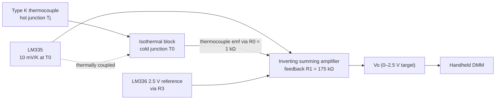
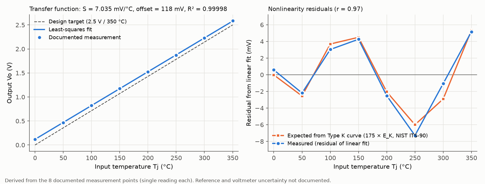

# Type-K Thermocouple Measurement & Signal Conditioning System

| | |
|---|---|
| **Status** | Complete (historical academic lab, June 2024). Characterization re-analysed in 2026 from the original data. |
| **Context** | Academic — *Instrumentação e Medida* (Instrumentation and Measurement), University of Beira Interior |
| **Team** | Alexandre Saraiva, Diogo Soares |
| **My contribution** | Joint lab work with one teammate: circuit design calculations, breadboard build and measurements. The report does not split tasks between the two authors. I added the 2026 data analysis (`analysis/`) on my own. |
| **Evidence** | [Report (PT, PDF)](REPORTKalexandreEEC.pdf) · [setup photo](termopar.png) · [dataset](data/measurements.csv) · [analysis script](analysis/characterize.py) · [generated results](results/characterization.md) |

---

## Engineering objective

Measure temperature from **0 °C to 350 °C** with a Type K thermocouple. Use automatic
cold-junction compensation (CJC) so that the output depends only on the hot-junction
temperature *Tj*. Scale the output to **0 V – 2.5 V** over that range.

## System requirements

These are derived from the report's problem statement. Status is assessed against the documented data.

| ID | Requirement (from report) | Status | Evidence |
|---|---|---|---|
| TC-R1 | Measurement range 0 °C – 350 °C, Type K thermocouple | Range covered by test points | 8 points, 0–350 °C in 50 °C steps |
| TC-R2 | Output 0 V – 2.5 V over the range | **Not met without calibration**: 0.119 V at 0 °C, 2.586 V at 350 °C | [results](results/characterization.md) |
| TC-R3 | Output depends only on *Tj* (automatic CJC with LM335 on the isothermal block) | **Not verified**: no test varied the cold-junction temperature | — |

## System architecture


```mermaid
flowchart LR
    TJ["Type K thermocouple<br/>hot junction Tj"] --> IB["Isothermal block<br/>cold junction T0"]
    LM335["LM335<br/>10 mV/K at T0"] --> SUM
    IB -->|"thermocouple emf via R0 = 1 kΩ"| SUM["Inverting summing amplifier<br/>feedback R1 = 175 kΩ"]
    LM335 -.->|"thermally coupled"| IB
    LM336["LM336 2.5 V reference<br/>via R3"] --> SUM
    SUM --> VO["Vo (0–2.5 V target)"]
    VO --> DMM["Handheld DMM"]
```

The amplifier sums three currents into the inverting node:
- the thermocouple emf, through R0;
- the LM335 voltage, through R2, which cancels the cold-junction term;
- the LM336 2.5 V reference, through R3, which cancels the LM335 offset of 2.73 V at 0 °C.

The schematic base is shown in the report (section 3). The op-amp part number is not documented.

## Hardware

| Item | Part / value | Source |
|---|---|---|
| Sensor | Type K thermocouple | Report |
| CJC sensor | LM335 on the isothermal block | Report |
| Offset reference | LM336 (2.5 V) | Report |
| Amplifier | Operational amplifier, inverting summing configuration (part not documented) | Report, schematic |
| Input stimulus | Omega CL511 calibrator, visible in the setup photo; how it was used is not documented | [termopar.png](termopar.png) |
| Output measurement | Handheld digital multimeter (model and uncertainty not documented) | [termopar.png](termopar.png) |
| Build | Solderless breadboard | [termopar.png](termopar.png) |


## Design calculations

Design equation from the report, valid when CJC and offset cancellation are ideal:

```
Vo = (R1 / R0) · Sk · Tj
```

| Quantity | Calculation (report) | Result | Review note |
|---|---|---|---|
| R1 | 2.5 V · R0 / E_K(350 °C) = 2.5 · 1000 / 14.293 mV | **175 kΩ** | The report's formula line writes 14.233 mV. Its result (175 kΩ) matches the correct table value of 14.293 mV. |
| R2 | R0 · 0.01 V/K / Sk, with Sk = 41 µV/°C | **243.9 kΩ** | The report states "243.90 Ω". The equation gives 1000 · 0.01 / 41×10⁻⁶ = 243 902 Ω, so this is a unit error in the report and in the previous README. Only the kΩ value is consistent with R3. |
| R3 | (R1/R2) · 2.73 V = (R1/R3) · 2.5 V → R3 = R2 · 2.5 / 2.73 | **223.4 kΩ** | Consistent with R2 = 243.9 kΩ. |

The values actually fitted on the breadboard (E-series substitutes, tolerances) are not documented.

Sk = 41 µV/°C is a linear approximation. The NIST ITS-90 Type K reference function gives
an average of 40.84 µV/°C over 0–350 °C (14.293 mV / 350 °C).

## Experimental setup and measurement procedure

What the documentation supports:

- One output voltage was recorded per nominal temperature, from 0 °C to 350 °C in 50 °C steps.
- The setup photo shows the Omega CL511 calibrator wired to the circuit input and a DMM on the output.

Not documented: whether the calibrator sourced a simulated thermocouple emf (and with which
cold-junction setting) or a physical thermocouple was used; the ambient temperature;
settling time; the DMM range; and whether any reading was repeated.

## Results

Documented measurements (report, section 4):

| Tj (°C) | 0 | 50 | 100 | 150 | 200 | 250 | 300 | 350 |
|---|---|---|---|---|---|---|---|---|
| Vo (V) | 0.119 | 0.468 | 0.825 | 1.178 | 1.523 | 1.870 | 2.228 | 2.586 |

## Calibration / characterization

*Derived from documented experimental measurements* by
[`analysis/characterize.py`](analysis/characterize.py). The full tables are in
[`results/characterization.md`](results/characterization.md).



| Parameter | Value |
|---|---|
| Sensitivity (least-squares slope) | **7.036 mV/°C** (design target 7.143 mV/°C; −1.3 % vs. 175 × Type K average slope) |
| Offset | **+118 mV** (≈ +16.6 °C equivalent at the design sensitivity) |
| R² | 0.99998 |
| Max / RMS residual from linear fit | 7.3 mV / 3.9 mV (≈ 1.0 °C / 0.55 °C equivalent) |

**Observation 1: the residuals are the thermocouple's own nonlinearity.** The residuals of the
linear fit follow the pattern expected from the Type K curve, calculated as 175 × E_K(T)
from the NIST ITS-90 reference function, with correlation r = 0.97. The conditioning
circuit therefore behaves linearly in emf. Most of the remaining ±7 mV is the intrinsic
sensor nonlinearity, which a Type K table/polynomial can correct and a gain trim cannot.

**Observation 2: the dominant error is offset, then gain.** Measured against the design
transfer line (2.5 V / 350 °C), the output reads +12 °C to +17 °C high across the range.

In-sample residual error after each correction model:

| Correction model | Max abs error | RMS error |
|---|---|---|
| None (design transfer) | 16.7 °C | 14.1 °C |
| Two-point (0 °C / 350 °C) | 1.6 °C | 0.7 °C |
| Least-squares linear | 1.0 °C | 0.6 °C |
| Gain/offset + Type K inverse table | 0.25 °C | 0.12 °C |

These numbers show how well each model fits the same 8 points. They are **not** accuracy
figures. The uncertainty of the reference temperature and of the voltmeter, and the
repeatability, were not documented. **Absolute measurement accuracy cannot be established
from the available documentation.**

## Sources of error

**Documented** (in data or report):
- Output offset of +119 mV at 0 °C, where the design expects 0 V.
- Span of 2.467 V (0 → 350 °C), where the design expects 2.500 V: gain error ≈ −1.3 %.
- Calculation inconsistencies in the report: the 14.233/14.293 mV typo in R1, and the Ω/kΩ unit error in R2.

**Engineering considerations** (plausible, not tested):
- *Offset cancellation sensitivity.* The 2.73 V LM335 term and the 2.5 V LM336 term
  cancel only if R2 and R3 match their ratio exactly. At the output, 1 mV of LM335
  error becomes ≈ 0.72 mV. The LM335 also has an initial calibration error unless trimmed.
- *Double or missing cold-junction compensation.* If the calibrator sourced an emf
  referenced to 0 °C while the circuit also added the LM335 cold-junction term, the
  output would carry an offset equal to the block temperature. This hypothesis has not
  been tested; it would be checked by recording the calibrator CJC setting and the LM335 voltage.
- *Thermocouple nonlinearity.* Its magnitude is quantified above.
- *Resistor tolerances* (R1/R0 sets the gain; R2/R3 set the cancellation), op-amp input
  offset and bias currents into the 1 kΩ/175 kΩ network, and DMM resolution and noise.

## Test & validation perspective

| Item | Status |
|---|---|
| Static transfer function at 8 points | **Tested** (documented data) |
| Linearity / residual analysis | **Derived** (2026, from documented data) |
| Repeatability, hysteresis, noise | Not tested |
| CJC effectiveness (vary T0 while Tj fixed) | Not tested |
| Traceable reference / uncertainty budget | Not available |

## Improvements (not implemented)

1. **Repeatability study:** ≥ 10 readings per point, plus upward/downward sweeps for hysteresis.
2. **CJC test:** hold Tj fixed and heat or cool the isothermal block. Record Vo and the LM335 voltage.
3. **Calibration against a traceable reference:** a calibrated thermocouple simulator or dry-block plus reference thermometer, and a DMM with a known uncertainty.
4. **Uncertainty budget (GUM):** reference, DMM, resolution, repeatability, CJC sensor, resistor drift.
5. **Automated acquisition:** DMM over SCPI/PyVISA, logging to CSV and an automated test report. The workflow is prototyped in simulation in [`automated-test-measurement-bench`](../automated-test-measurement-bench/).
6. **Linearization:** apply the Type K inverse polynomial in firmware or post-processing.

## Reproduce the analysis

```bash
cd thermocouple-temperature-system/analysis
pip install -r requirements.txt
python characterize.py      # rewrites ../results/characterization.md and the PNG
```
