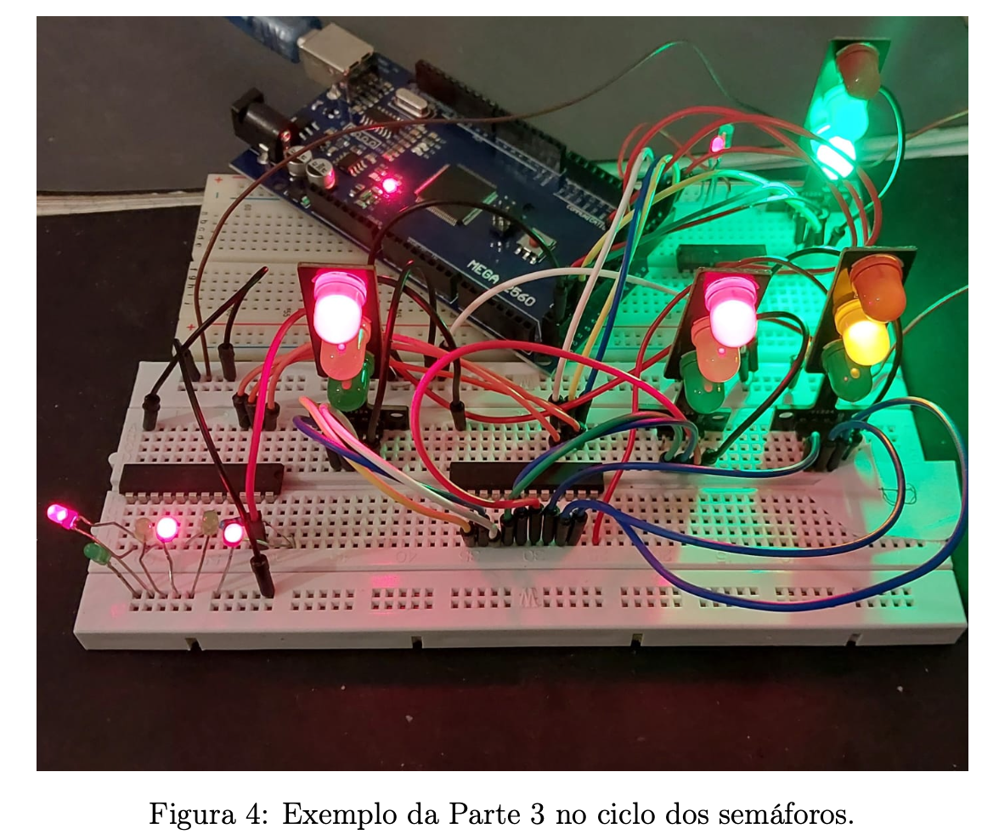

#  Traffic Light Control System (ATmega2560)

Embedded systems project implementing a **traffic light controller with pedestrian support**, using the **ATmega2560 microcontroller** and **Assembly programming**.

---

##  System Prototype

---

##  Project Report

📄 [Technical Report – Traffic Light Control System](MICRO2lab25.pdf)

---

##  Overview

This project implements a **real-time traffic light control system** with:

- Multiple traffic lanes (A, B, C)
- Pedestrian crossing requests
- External interrupt handling (INT0 and INT1)
- Time-controlled state transitions

The system was fully developed in **Assembly**, providing low-level control over the hardware.

---

##  System Features

###  Traffic Light Cycle
- Green → Yellow → Red sequence
- Timed using software counters (~500 ms resolution)

###  Pedestrian Request (INT0)
- Triggered by external button
- Forces safe transition:
  - Vehicles → Red
  - Pedestrians → Green

###  Independent Crossing (INT1)
- Separate pedestrian crossing
- Does not interrupt main traffic flow
- Includes minimum delay between activations (30s)

---

##  Architecture

The system is based on:

- **ATmega2560 (AVR)**
- GPIO control via PORTA, PORTB, PORTC
- External interrupts (INT0, INT1)
- Software timing loops

---

##  Hardware Components

- ATmega2560 (Arduino Mega)
- LEDs (traffic lights simulation)
- Push buttons (interrupt triggers)
- Breadboard + wiring
- Logic device (GAL22V10)

---

##  Technologies Used

- Assembly (AVR)
- Embedded Systems
- Digital Logic (PLD / GAL22V10)
- Interrupt-driven programming

---

##  Results

The system successfully demonstrated:

- Correct traffic sequencing
- Real-time response to interrupts
- Concurrent operation of independent subsystems

 Limitation:
- After first interrupt, system may not handle new requests properly  
  (requires improvement in flag reset / control flow)

---

##  Academic Context

-  Electrical and Computer Engineering  
-  University of Beira Interior  
-  Course: Microprocessors

---

##  Author

**Alexandre Saraiva**

🔗 LinkedIn  
https://linkedin.com/in/alexandre-saraiva12  

💻 GitHub  
https://github.com/ALEXs-G

---

##  Future Improvements

- Replace delay loops with hardware timers
- Improve interrupt reactivation logic
- Modularize code for scalability
- Add PCB design instead of breadboard

---

##  Key Takeaways

This project demonstrates:

- Low-level embedded programming
- Real-time system design
- Hardware/software integration
- Interrupt-driven architecture

---
