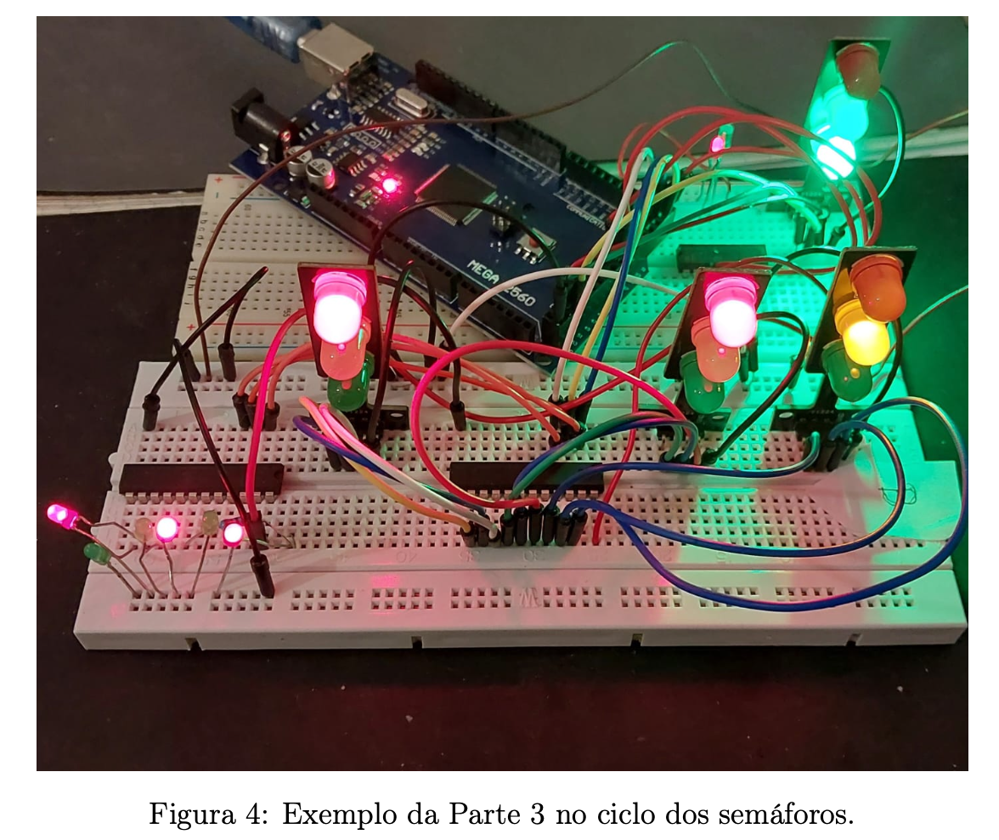

# Traffic-Light Controller with Pedestrian Interrupts — ATmega2560 (AVR Assembly) + GAL22V10

| | |
|---|---|
| **Status** | Partial. Parts 1 and 2 work; Part 3 does not accept repeated requests (documented limitation). |
| **Context** | Academic — *Microprocessadores* (Microprocessors), University of Beira Interior, 2026 |
| **My contribution** | Single-author report (Alexandre Saraiva); individual task split not documented. |
| **Evidence** | [Report (PT, PDF)](MICRO2lab25.pdf) · [setup photo](setup.jpg) · source files below |

---

## Function

| Part | Behaviour | Source |
|---|---|---|
| 1 | Three vehicle lights (A, B, C) cycle green → yellow → red. Software delay loops count 500 ms ticks (10 s green, 3 s yellow). | [`codeAssembly_Parte1.asm`](codeAssembly_Parte1.asm), [`codeWINCUPL_Parte1.pld`](codeWINCUPL_Parte1.pld) |
| 2 | Pedestrian request on **INT0** (PD0). Accepted only while a light is green; forces yellow, then all-red, then the cycle resumes. The request is held in flag `r19`. | [`codeASM_parte2_INT.asm`](codeASM_parte2_INT.asm), [`codeAsm_p2_3.asm`](codeAsm_p2_3.asm) |
| 3 | Independent crossing on **INT1** (PD1). Vehicles go to yellow then red; pedestrian lights on PORTC go green for 5 s. Minimum 30 s between activations. | [`code_p3_INtIn.asm`](code_p3_INtIn.asm), [`codeWINCUPL_Peoes.pld`](codeWINCUPL_Peoes.pld) |

The GAL22V10 decodes the light outputs; its logic is defined in the WinCUPL `.pld` files.

## Test results (from report §7)

| Test | Result |
|---|---|
| Part 1 state sequence, 6 states, timing 10 s / 3 s | Pass, observed on LEDs |
| Part 2: INT0 request during green | Pass |
| Part 3: INT1 independent crossing, first activation | Pass |
| Repeated INT0/INT1 requests after the first one | **Fail.** New requests are no longer recognized. The report suspects missing flag re-initialization or broken control flow after the interrupt is serviced. |

Timing accuracy was specified as ±0.5 s on 500 ms ticks. No measured timing data is documented.

## Source code status

As committed originally, all four `.asm` files failed to assemble because of copy artefacts:
six lines with two instructions merged, and `recall` typed for `rcall`. These were corrected
mechanically in commit `ac072e2`, with no logic changes. All four files now assemble with
AVRA 1.4.2. The corrected files have not been re-tested on hardware.

## Improvements (not implemented)

- Replace delay loops with Timer/Counter interrupts so timing is deterministic and measurable.
- Fix the re-arm defect: clear request flags and the external-interrupt flags (`EIFR`) at the end of each service sequence. Add a test that sends N consecutive requests.
- Measure the state durations with a logic analyser and compare them with the ±0.5 s requirement.
