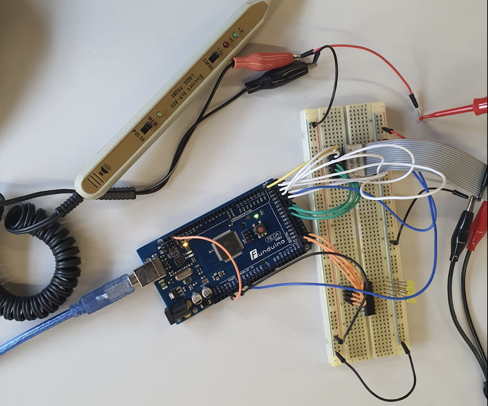

# 💧 Water Filtration & pH Control System (ATmega2560)

Embedded systems project implementing an **automated water filtration and pH regulation system** using the **ATmega2560 microcontroller** programmed in **Assembly**.

---

## 📸 System Concept

---

## 📄 Project Report

📥 [Download Full Report](/REPORT.pdf)

---

## 🧠 Overview

This project simulates a **smart pool water management system** capable of:

- Activating filtration cycles automatically
- Measuring water pH levels using sensors
- Comparing real-time values with a reference
- Automatically correcting pH levels

The system operates using **interrupt-driven logic** and low-level hardware control.

---

## ⚙️ System Functionality

### 🟢 Filtration Control
- Triggered by external clock signal
- System starts in **sleep mode**
- Activates filtration cycle when triggered

### 🧪 pH Measurement
- Sensor reading initiated via control signal
- ADC used to capture pH value
- Value stored in input port

### ⚖️ pH Comparison Logic
- Compares sensor value with reference value
- Applies tolerance margin (+3)

### 🔄 Automatic Regulation
- If pH too high → activates **pH decrease (PhA)**
- If pH too low → activates **pH increase (PhB)**
- Runs continuously during filtration cycle

---

## 🏗️ Architecture

The system is composed of:

- ATmega2560 (Arduino)
- ADC module (analog to digital conversion)
- Input ports (sensor + reference)
- Output ports (control signals)
- Interrupt-based control logic

📌 The system uses:
- Sleep mode
- External interrupts
- Polling and ADC conversion

---

## 💻 Technologies Used

- Assembly (AVR)
- Embedded Systems Programming
- ADC (Analog-to-Digital Conversion)
- Interrupt handling
- Low-level hardware control

---

## 📊 Example Logic

| Sensor pH | Reference | Action |
|----------|----------|--------|
| Equal | Within tolerance | Maintain |
| Higher | Above +3 | Decrease pH |
| Lower | Below reference | Increase pH |

---

## 📚 Academic Context

- 🎓 Electrical and Computer Engineering  
- 🏫 University of Beira Interior  
- 📘 Course: Microprocessors  

---

## 👨‍💻 Author

**Alexandre Saraiva**

🔗 LinkedIn  
https://linkedin.com/in/alexandre-saraiva12  

💻 GitHub  
https://github.com/ALEXs-G  

---

## 🚀 Key Learning Outcomes

- Assembly programming on AVR architecture
- Real-time system design
- Interrupt-driven control systems
- ADC integration and sensor processing
- Hardware/software interaction

---

## ⚠️ Notes

- Project implemented in an academic context
- Some parts required iterative debugging and optimization
- Focus on understanding embedded system architecture

---

## 🔥 Why This Project Matters

This project demonstrates:

✔ Embedded systems design  
✔ Real-world control system logic  
✔ Low-level programming skills  
✔ Sensor integration and automation  

---
