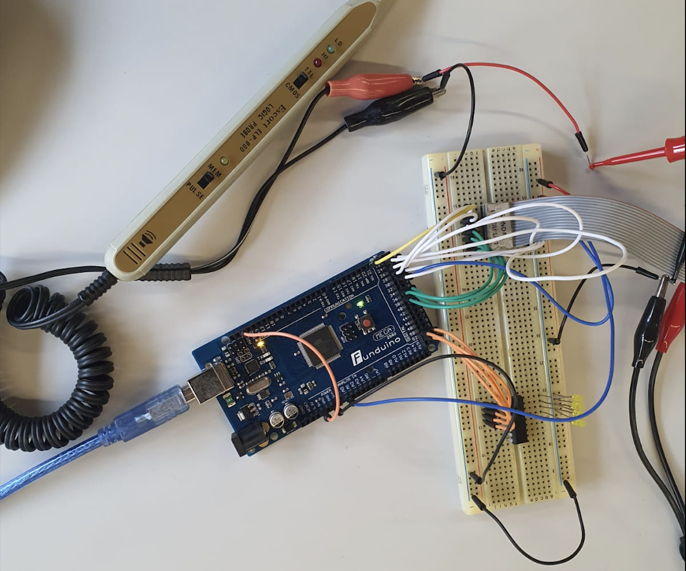

# Pool Filtration & pH Control — ATmega2560 in AVR Assembly

| | |
|---|---|
| **Status** | Historical academic exercise. The committed source **does not assemble** (see [code review](CODE_REVIEW.md)). |
| **Context** | Academic — *Microprocessadores* (Microprocessors), University of Beira Interior, June 2024 |
| **My contribution** | Individual report. The report's conclusion states that the code was completed using code provided by colleagues. The 2026 code review in this folder was produced with AI coding assistance (see commit history). |
| **Evidence** | [Report (PT, PDF)](REPORT.pdf) · [original source](codeControler.asm) · [code review](CODE_REVIEW.md) · [reviewed source](codeController_reviewed.asm) |
| **Test evidence** | Simulation in AVR Studio (report §5); 4-case state table (report §4). No hardware test is documented. |

---

## Specification (report §3)

Control a pool water-filtration system with an ATmega2560:

1. The controller sleeps until a clock (`ClkInicFilt`) triggers an interrupt that starts filtration. Output `Mon` = 1.
2. During filtration, start a pH reading (`PhS` = 1). An interrupt signals that the reading is available.
3. Compare the reading with an 8-bit reference port:
   - reading > reference + 3 → `PhA` = 1 (lower the pH)
   - reading < reference → `PhB` = 1 (raise the pH)
4. Repeat until a second clock (`ClkTmpFilt`) ends the cycle. Then `Mon` = 0 and the controller returns to sleep.

## Implementation (as written)

| Feature | Implementation |
|---|---|
| Low power | Idle sleep mode (`SMCR = $01`); wake on INT0 or ADC complete |
| Start trigger | INT0, rising edge |
| pH acquisition | On-chip ADC0, 8-bit left-adjusted, interrupt on completion. The spec defines an 8-bit input port instead. |
| Decision | Band comparison \[ref, ref + 3\] driving PhA/PhB on PORTA |
| Display | ADC value shifted onto PORTC LEDs |

## Documented test cases (report §4)

| ADC value | Reference (+3) | PhA | PhB | Expected action | Reported valid |
|---|---|---|---|---|---|
| 8 | 5 (8) | 0 | 0 | Hold | Yes |
| 0 | 1 (4) | 0 | 1 | Raise pH | Yes |
| 10 | 6 (9) | 1 | 0 | Lower pH | Yes |
| 6 | 10 (13) | 0 | 1 | Raise pH | Yes |

The report does not document which code version, simulator settings or stimulus files produced this table.

## Code review findings (2026)

Full details are in [CODE_REVIEW.md](CODE_REVIEW.md).

- The original source fails to assemble: `PINFILTER` is undefined.
- High-severity defects: outputs are written to `PINx` registers, which toggles the pins instead of
  setting them. The shutdown path falls through into `RETI` with an empty stack. The end-of-cycle
  signal is read from a pin configured as an output, so the filtration loop cannot terminate.
- [`codeController_reviewed.asm`](codeController_reviewed.asm) fixes only the unambiguous defects
  and assembles with AVRA. Design-level issues that depend on the intended wiring are listed but not
  changed. **The reviewed version has not been simulated or tested on hardware.**

## What this project shows

- Interrupt vector placement, sleep modes, external interrupts and ADC configuration on the ATmega2560 at register level.
- A post-hoc code review that separates confirmed behaviour, defects, assumptions and suggested corrections.
